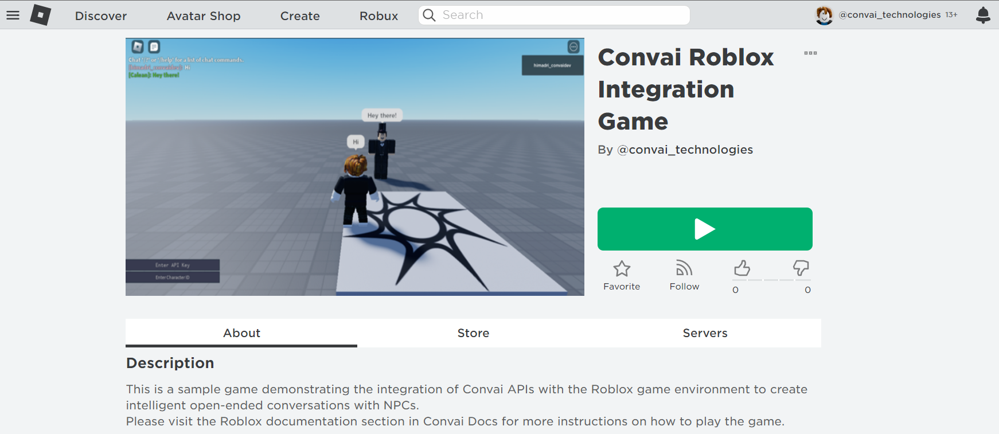
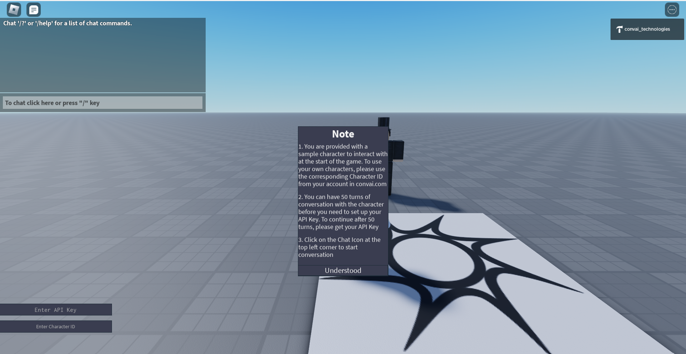
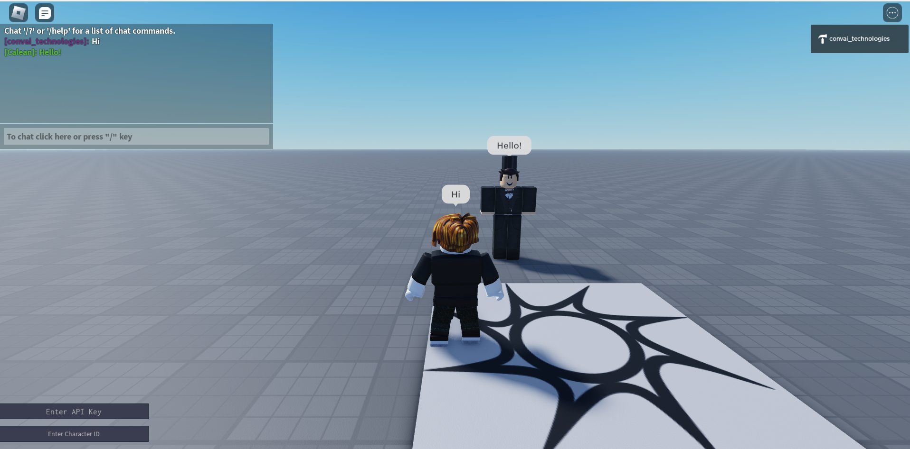

# Sample Game 1

### [Click here to play the game in Roblox](https://www.roblox.com/games/11398111980/Convai-Roblox-Integration-Game)

### Access the Game Code

Download the game file: [Download](https://storage.googleapis.com/convai-assets-storage/Convai%20Roblox%20Integration%20Game%20Code.rbxl)


Current Version: Ver 1.1 - Simple Character API Integration


<figure><figcaption></figcaption></figure>

This is a very simple game that you can access to try out some sample conversations with your character.&#x20;


Points to Remember:

1. The game loads with a sample character by default. You can interact with this default character or you can choose to replace it with your own character that you created from our site or through our APIs. Just enter the corresponding Character ID in the respective input box at the bottom left corner of the screen, press ENTER and you are good to go.
2. For beginners, we provide 50 sample conversations that they can carry out with the characters they want, without setting up their API Key. To continue with more conversation, please get your API Key from our site and enter the value in the respective input box at the bottom left corner, and press ENTER.
3. Please refer to [Broken link](broken-reference "mention") , for further steps.


### Play the Game:

To play the game follow the given steps:

1. Get your API Key from our website. It is necessary to carry on any conversation in the game after the free quota has expired.
2. Get the character ID of the new character that you have created in the Character Creator Tool.\
   If you do not have one, there is no need to worry. The game comes loaded with a sample character to explore.
3.  Visit the link given above for the game.\

    <figure><figcaption></figcaption></figure>
4. Click on the green Play button. That will open Roblox locally for you to play.
5.  You are ready to converse with the character

    <figure><figcaption></figcaption></figure>

    Click on the **Understood** button, to close the notifications. Read it once though.\
    Enter the API Key and the Character ID in the bottom left section of the screen. Enter the value in each of the text boxes and press Enter.\
    Remember to press **ENTER** after entering the value to register it in the backend.
6.  Now click on the Chatbox Icon or press the "/" icon on the keyboard to start a conversation. Start by saying "Hi!" and pressing **ENTER**.\

    <figure><figcaption></figcaption></figure>
7. That's it. You can continue your conversation and keep testing your characters.
