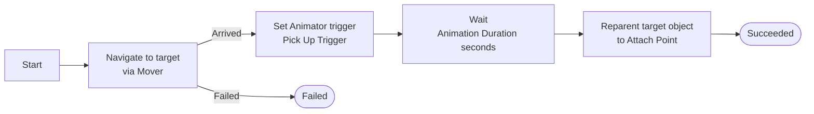

# Action Executors

## What Is an Executor?

An executor is a **MonoBehaviour component** that performs the actual in-game behavior when an action command is received. When the `ConvaiActionDispatcher` receives a command like `Move To` targeting `Crate`, it calls the executor you assigned to that action definition — and the executor does the work.

The Convai SDK ships with six ready-to-use executors that cover common scenarios:

| Executor                            | What It Does                                      | Needs Target |
| ----------------------------------- | ------------------------------------------------- | :----------: |
| `Unity Event Action Executor`       | Fires a UnityEvent — attach any callback          |      No      |
| `Look At Target Action Executor`    | Smoothly rotates the NPC to face a target         |      Yes     |
| `Animator Trigger Action Executor`  | Sets an Animator trigger by action name           |      No      |
| `Transform Move To Action Executor` | Teleports the NPC to a target (prototype only)    |      Yes     |
| `NavMesh Move To Action Executor`   | Navigates the NPC to a target via NavMesh         |      Yes     |
| `Pick Up Action Executor`           | Moves to, animates, and reparents a target object |      Yes     |


One executor component can be referenced by **multiple action definitions**. There is no need to add duplicate components for actions that share the same behavior logic.


***

## Unity Event Action Executor

**Add Component:** `Convai/Actions/Unity Event Action Executor`

The simplest executor. When triggered, it fires a standard Unity `UnityEvent` and immediately returns `Succeeded`.

### Inspector Fields

| Field          | Description                                                                                         |
| -------------- | --------------------------------------------------------------------------------------------------- |
| **On Execute** | A UnityEvent that fires when the action runs. Wire it to any method on any component in your scene. |

### When to Use

Use this executor for any action that doesn't need a target and maps directly to a simple callback:

* Playing a sound effect
* Triggering a UI notification or panel
* Setting a quest flag or game state variable
* Calling a custom method on another component

### Example

In a fire safety training simulation, a `Report Hazard` action can use `Unity Event Action Executor` to call a method that logs the hazard report to the training system, triggers a confirmation sound, and updates the score display — all wired through a single UnityEvent.


`Unity Event Action Executor` executes synchronously and returns immediately. If you need async behavior (waiting for an animation, coroutine, or task), write a custom executor instead.


***

## Look At Target Action Executor

**Add Component:** `Convai/Actions/Look At Target Action Executor`

Smoothly rotates a transform toward a target object or character over a configurable duration.

### Inspector Fields

| Field           | Type            | Default | Description                                                                      |
| --------------- | --------------- | ------- | -------------------------------------------------------------------------------- |
| **Rotate Root** | Transform       | Self    | The transform to rotate. Defaults to the executor's own transform if left empty. |
| **Duration**    | float (seconds) | `0.5`   | How long the rotation takes. Higher values produce a slower, more natural turn.  |

### When to Use

* NPC turns to face an object when describing or interacting with it
* Character looks toward another NPC the player mentions
* Museum guide, tour instructor, or presenter rotates to face the subject of discussion

### Requirements

Requires a resolved target — set **Target Requirement** to `Object`, `Character`, or `Either` in the action definition. The action fails if no target is resolved.

### Example

A museum guide has a `Look At` action. When the player asks "What's that painting behind you?", the AI selects `Look At` targeting the `Renaissance Painting` object. The NPC's head smoothly rotates toward the painting over 0.5 seconds.

***

## Animator Trigger Action Executor

**Add Component:** `Convai/Samples/Animator Trigger Action Executor`

Maps backend action names to Animator triggers using a configurable binding list.

### Inspector Fields

| Field        | Type     | Description                                                                             |
| ------------ | -------- | --------------------------------------------------------------------------------------- |
| **Animator** | Animator | The Animator component to set triggers on. Drag it from the same or a child GameObject. |
| **Bindings** | List     | Each binding maps one **Action Name** to one **Trigger Name** in the Animator.          |

Each entry in **Bindings**:

| Sub-field        | Description                                                 |
| ---------------- | ----------------------------------------------------------- |
| **Action Name**  | The action name this binding handles (e.g., `Wave`)         |
| **Trigger Name** | The Animator trigger parameter to set (e.g., `WaveTrigger`) |

### When to Use

* Mapping conversation actions to animation states
* Playing greeting, farewell, or emotion animations
* Triggering gesture animations (nodding, pointing, waving)

### Example Setup

| Action Name | Trigger Name   |
| ----------- | -------------- |
| `Wave`      | `WaveTrigger`  |
| `Sit Down`  | `SitTrigger`   |
| `Nod`       | `NodTrigger`   |
| `Point`     | `PointTrigger` |

### Failure Cases

The executor returns `Failed` if:

* No binding is found for the incoming action name
* The **Animator** field is not assigned

***

## Transform Move To Action Executor

**Add Component:** `Convai/Samples/Transform Move To Action Executor`

Instantly moves a transform to the resolved target's position, with an optional offset.

### Inspector Fields

| Field         | Type      | Description                                                               |
| ------------- | --------- | ------------------------------------------------------------------------- |
| **Move Root** | Transform | The transform to move. Defaults to the executor's own transform if empty. |
| **Offset**    | Vector3   | Position offset applied relative to the target's position.                |

### When to Use


**Prototype and testing only.** This executor teleports the character to the target instantly — there is no movement animation, no pathfinding, and no physical transition. It is provided as a quick way to verify your action wiring before adding a real movement system.

For production use, replace this executor with `NavMesh Move To Action Executor` or a custom executor that uses your game's own movement system (character controller, physics, or custom locomotion).


* Verifying that action names, target names, and executor assignment are correct
* Early prototyping before NavMesh is baked
* Simple non-game applications where instant position changes are acceptable

***

## NavMesh Move To Action Executor

**Add Component:** `Convai/Samples/NavMesh Move To Action Executor`

Moves a NavMeshAgent to the resolved target's position and waits asynchronously until the agent arrives.

### Inspector Fields

| Field                 | Type          | Default | Description                                                            |
| --------------------- | ------------- | ------- | ---------------------------------------------------------------------- |
| **Agent**             | NavMeshAgent  | —       | The NavMeshAgent to control. Drag it from the same GameObject.         |
| **Stopping Distance** | float (units) | `0.5`   | How close the agent must get before the action is considered complete. |

### When to Use

* Any scene where NPCs need to walk to objects or locations
* Training simulations where the instructor demonstrates equipment usage
* Games where the character follows player-directed navigation requests

### Requirements

* A NavMesh must be **baked** in the scene (Window → AI → Navigation → Bake).
* The target object must have a position reachable on the NavMesh.
* The **Agent** field must be assigned.

### Example

In a fire safety simulation, an instructor character has a `Go To` action. When the trainee says "Show me the fire extinguisher," the AI selects `Go To` with `Fire Extinguisher` as the target. The NavMeshAgent navigates through the scene and stops within 0.5 units of the extinguisher.

### Behavior

1. The executor sets the agent's destination to the target's world position.
2. It then loops asynchronously, checking the remaining path distance each frame.
3. When the agent is within **Stopping Distance**, it returns `Succeeded`.
4. If the target GameObject is destroyed mid-navigation, it returns `Failed`.
5. If the batch is canceled (e.g., a new batch with `ReplaceCurrent` policy arrives), it returns `Canceled`.

***

## Pick Up Action Executor

**Add Component:** `Convai/Samples/Pick Up Action Executor`

A compound executor that chains three behaviors in sequence: navigate to the target, play a pick-up animation, then reparent the target to an attach point (the character's hand or a carry socket).

### Inspector Fields

| Field                  | Type                        | Description                                                                                   |
| ---------------------- | --------------------------- | --------------------------------------------------------------------------------------------- |
| **Mover**              | NavMeshMoveToActionExecutor | The movement executor to use for navigation. Must be assigned.                                |
| **Animator**           | Animator                    | The Animator to trigger the pick-up animation on.                                             |
| **Pick Up Trigger**    | string                      | The Animator trigger parameter name to set (default: `PickUp`).                               |
| **Attach Point**       | Transform                   | The transform the picked-up object is reparented to (e.g., the character's hand bone).        |
| **Animation Duration** | float (seconds)             | How long to wait after triggering the animation before reparenting the object (default: `1`). |

### Execution Sequence

### When to Use

* Characters that pick up and carry objects
* Training simulations where an instructor retrieves equipment
* Game scenarios where the NPC collects or handles props

### Example

In a warehouse safety simulation, a supervisor character has a `Pick Up` action. When the trainee says "Can you grab the safety helmet?", the supervisor navigates to the helmet rack, plays a pick-up animation, and the helmet becomes a child of the supervisor's hand transform — carried visually by the character.

### Requirements

* NavMesh must be baked (used internally by `Mover`).
* **Mover**, **Animator**, and **Attach Point** must all be assigned.

***

## Conclusion

All six executors cover a wide range of common NPC behaviors out of the box. For behaviors not covered here — custom locomotion systems, UI interactions, physics interactions, or anything specific to your project — see [Writing Custom Executors](writing-custom-executors.md).
