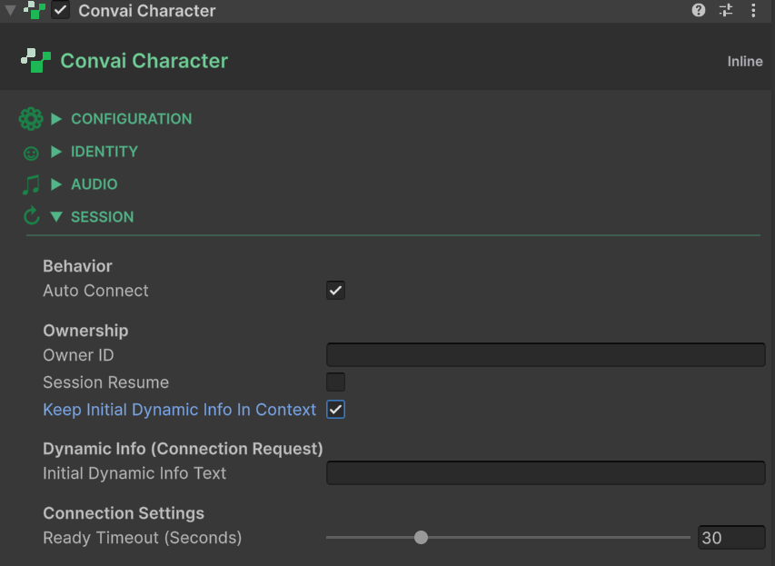

# Static Context at Connection Time

## Setting a Fixed Scenario Context Before the Conversation Begins

In addition to the runtime Dynamic Context system, Convai supports a separate mechanism for injecting a fixed block of context at the moment a conversation connection is established. This initial context is sent once — before the character speaks its first word — and is ideal for information that describes the simulation scenario itself rather than the evolving state of the session.

Understanding the distinction between initial context and runtime Dynamic Context prevents both content gaps and redundant updates.

## Initial Context vs. Runtime Context

These are two independent, complementary systems. Use them together rather than choosing one or the other.

|                           | Initial Context                               | Runtime Dynamic Context                                      |
| ------------------------- | --------------------------------------------- | ------------------------------------------------------------ |
| **When sent**             | Once, at conversation connection time         | At any point during a session                                |
| **How configured**        | `ConvaiCharacter` Inspector fields            | `ConvaiDynamicContextCommand` or `IConvaiDynamicContext` API |
| **Can change at runtime** | No                                            | Yes                                                          |
| **Cleared by `Reset()`**  | No                                            | Yes                                                          |
| **Typical use**           | Scenario title, facility name, character role | Player status, equipment, mistakes, choices                  |

Use initial context for facts that are true before the conversation begins and will not change during the session. Use runtime context for anything that evolves as the simulation progresses.

## Inspector Fields

The initial context fields are on the `ConvaiCharacter` component, under the **Dynamic Info (Connection Request)** header.

<figure><figcaption></figcaption></figure>

### Initial Dynamic Info Text

| Field                         | Type     | Default |
| ----------------------------- | -------- | ------- |
| **Initial Dynamic Info Text** | `string` | `""`    |

A free-text string sent verbatim as part of the room connection request payload. The character receives this text before the first conversational turn.

**Format recommendation:** Write this field in the same `"Name is Value"` style used by the runtime tracker. This ensures the initial context blends naturally with any runtime state updates that follow:

```
Facility is Offshore Platform Alpha
Training scenario is Well Control Emergency
Character role is Emergency Response Supervisor
```

You can also write it as plain prose if the character's persona calls for a narrative framing of the scenario.

### Initial Dynamic Info Keep In Context

| Field                                    | Type   | Default |
| ---------------------------------------- | ------ | ------- |
| **Initial Dynamic Info Keep In Context** | `bool` | `false` |

When enabled, the server retains the initial context text across LLM turns for the duration of the session — it is treated as a persistent part of the character's awareness. When disabled, the text is injected as ephemeral context that the server may not carry forward beyond the first turn.

Enable this for scenario-level facts (facility name, role, overarching training goal) that the character should remember throughout the entire conversation. Leave it disabled for one-time contextual hints that only need to inform the opening response.


Calling `Reset()` at runtime clears all tracked dynamic states and events, but it does **not** re-send the initial dynamic info text. The initial context is sent once per connection and cannot be re-injected without ending and restarting the conversation.


## Choosing the Right Mechanism

```
Before conversation → Initial Context (ConvaiCharacter Inspector)
During conversation → Runtime Dynamic Context (ConvaiDynamicContextCommand or API)
```

A practical rule: if you would write the information into the character's system prompt and it never changes within a session, it belongs in **Initial Dynamic Info Text**. If it needs to reflect real-time simulation state — the trainee's current score, the equipment they just picked up, a mistake they just made — it belongs in the runtime Dynamic Context API.

**Example — onboarding simulation:**

| Fact                                        | Where it belongs          |
| ------------------------------------------- | ------------------------- |
| `"Facility is Greenfield Processing Plant"` | Initial Dynamic Info Text |
| `"Onboarding role is Process Technician"`   | Initial Dynamic Info Text |
| `"Equipment is Full PPE kit"`               | Runtime `SetState`        |
| `"Checkpoint is Loading Bay cleared"`       | Runtime `SetState`        |
| `"Trainee signed the safety declaration"`   | Runtime `AddEvent`        |

## Reading Initial Context at Runtime

The initial context fields are exposed as read-only properties on `ConvaiCharacter`. Use them to display the current scenario description in a UI label or to include scenario metadata in other game systems:

```csharp
using Convai.Runtime.Components;
using TMPro;
using UnityEngine;

public class ScenarioLabel : MonoBehaviour
{
    [SerializeField] private ConvaiCharacter _character;
    [SerializeField] private TextMeshProUGUI _label;

    private void Start()
    {
        if (_character != null)
            _label.text = _character.InitialDynamicInfoText;
    }
}
```

The properties are:

* `ConvaiCharacter.InitialDynamicInfoText` — `string`, read-only
* `ConvaiCharacter.InitialDynamicInfoKeepInContext` — `bool`, read-only

## What's Next

* [Usage Examples](usage-examples.md) — see initial and runtime context working together across realistic simulation scenarios.
* [Scripting API Reference](scripting-api-reference.md) — drive runtime context from C# game logic.

## Conclusion

Initial context and runtime Dynamic Context serve different purposes and work best together. Use the `ConvaiCharacter` Inspector fields to establish the scenario's fixed facts, then use `ConvaiDynamicContextCommand` or the scripting API to reflect what changes as the simulation progresses.
