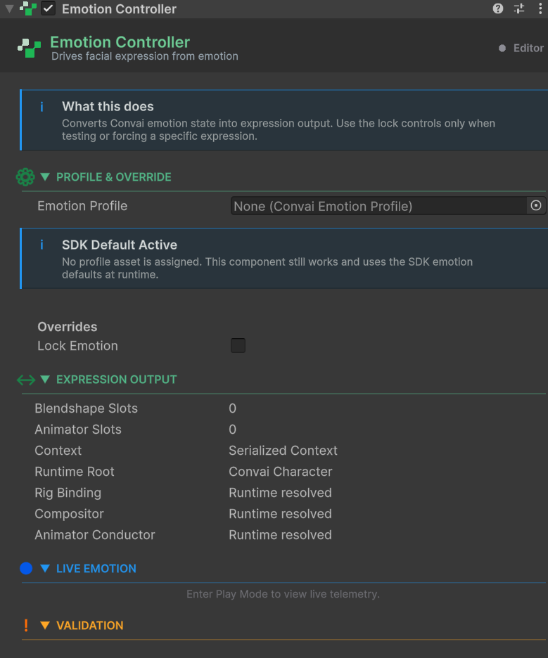
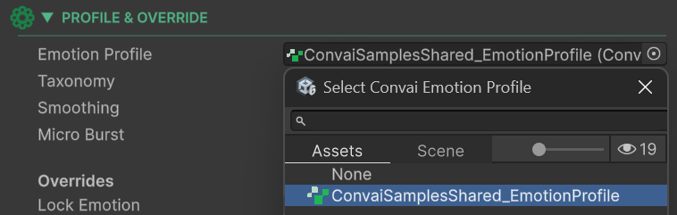

# Quick Start

## Get Your First Emotionally Reactive NPC Working

This guide walks you through the fastest path to a working emotion setup. You will attach the controller, assign the bundled sample profile, and see your character's face respond to live AI emotion signals in Play Mode — with no configuration required upfront.


**Prerequisites**

* A Unity scene with a `ConvaiCharacter` component already set up and working (the character should respond to speech).
* Your Convai API key is configured in **Tools → Convai → Configuration**.


## Step-by-Step Setup



**Add the Emotion Controller**

Select your NPC's root GameObject in the Hierarchy. In the Inspector, click **Add Component** and search for **Emotion Controller**, or navigate to **Convai → Embodiment → Emotion Controller**.

The component appears with a **Profile** field that is currently empty.

<figure><figcaption></figcaption></figure>



**Locate the Bundled Sample Profile**

In the Project window, navigate to:


```
Packages / Convai SDK for Unity / SamplesShared / Resources / Embodiment / Modules / Emotion
```


You will find two assets:

| Asset                                 | Purpose                                                                                                                        |
| ------------------------------------- | ------------------------------------------------------------------------------------------------------------------------------ |
| `ConvaiSamplesShared_EmotionProfile`  | Pre-configured expression slots for Reallusion characters, with smoothing, micro-burst, and neutral alternation already tuned. |
| `ConvaiSamplesShared_EmotionTaxonomy` | The default emotion vocabulary (already referenced by the profile above).                                                      |


The bundled profile is configured for **Reallusion** characters out of the box. If your character uses a different rig, the pipeline will still run — but you will need to update the blendshape names in the profile slots to match your character. See Emotion Profile for how to do this.




**Assign the Profile**

Drag `ConvaiSamplesShared_EmotionProfile` from the Project window into the **Profile** field on the `ConvaiEmotionController` component.

<figure><figcaption></figcaption></figure>


The bundled asset is **read-only** — it lives inside the package. To adjust any settings, duplicate it first (**Ctrl+D** on Windows / **Cmd+D** on macOS), move the copy into your own `Assets/` folder, and assign the copy instead.




**Enter Play Mode and Speak**

Press **Play**. Talk to the character using your configured microphone. As the AI responds, watch the `ConvaiEmotionController` in the Inspector — the **Current** reading updates live.


**Expected result:** The NPC's facial expression changes as the conversation develops — a subtle smile during warm exchanges, a more serious expression during difficult topics. If you are using a Reallusion character with the default rig, you will see the shapes activate on the character's face immediately.




## What Just Happened

When you spoke to the character, the following occurred automatically:

1. The Convai backend processed your speech and decided on an emotional state for the character.
2. It sent a short message containing a label such as `"happy"` and an intensity value from 1 to 3.
3. `ConvaiEmotionController` received this, resolved `"happy"` to the canonical label `"joy"` via the taxonomy, and smoothed the intensity score over time.
4. The profile's pre-configured blendshape slots wrote the smoothed score to the character's facial blendshapes every frame.
5. `EmotionReading.Current` on the controller reflected the live state throughout.

All of this runs automatically for the lifetime of the session.

## Using a Non-Reallusion Character

If your character has different blendshape names, open the duplicated profile and update the **Blendshape Names** field in each slot to match your character's shapes. The slot structure and all other settings remain valid — only the shape names need to change.

For a walkthrough of how slots work and how to configure them for any rig, see Emotion Profile and Output Bindings.


Mapping blendshapes for a new character can be done quickly with the help of an AI coding assistant. Share your character's blendshape list and ask it to generate the slot configuration — the slot format is straightforward and maps directly to the Inspector fields.


## Next Steps

* **Adapt the profile to your own rig** → [Emotion Profile](emotion-profile.md)
* **Understand how slot mappings work** → [Output Bindings](output-bindings.md)
* **Customise the emotion vocabulary** → [Emotion Taxonomy](emotion-taxonomy.md)
* **Read emotion state or trigger overrides from script** → [Scripting API](scripting-api-reference.md)
* **Something not working?** → [Troubleshooting & Diagnostics](troubleshooting-and-diagnostics.md)

## Conclusion

You now have a complete emotion pipeline running on your character — server-driven, smoothed, and reacting to live AI decisions. If your character is Reallusion-based, expressions are already active. If not, update the blendshape names in the profile and the rest of the configuration carries over unchanged.
