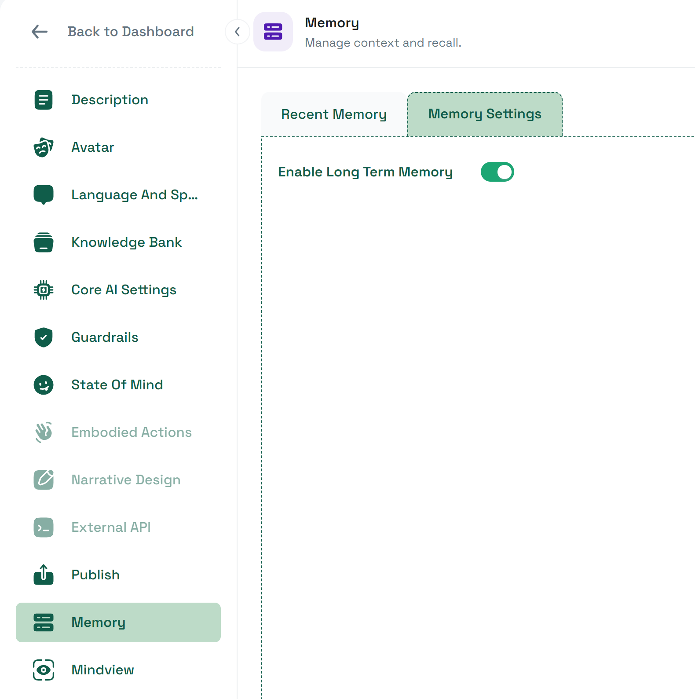

# Quick Start

## Your First Cross-Session Memory

Long-Term Memory requires two things to work: memory must be enabled for the character on the Convai Dashboard, and the SDK must send a stable user identifier with each session. The second part is handled automatically by `DeviceEndUserIdProvider`. This guide covers the minimal steps to get from zero to a character that remembers you.


**Prerequisites**

* Your Convai API key is configured in **Tools → Convai → Configuration**.
* A Unity scene with a `ConvaiCharacter` component already set up and working (the character should respond to speech).


## Steps



**Enable memory on your character**

Open the [Convai dashboard](https://convai.com) and select your character. Navigate to **Memory → Memory Settings** and enable the **Long-Term Memory** toggle.

This is an opt-in setting — memory is **off by default**. The character will not accumulate or use memories until you enable it here. For a full walkthrough of the dashboard UI, see the [Memory Settings documentation](https://docs.convai.com/api-docs/convai-playground/character-customization/memory#memory-settings).


Enabling memory affects all sessions for that character across all deployments — not just your Unity project. If the character is shared with other team members or projects, coordinate before enabling.


<figure><figcaption></figcaption></figure>



**Enter Play Mode and start a conversation**

Press **Play** in the Unity Editor. Start a conversation with the character and share a few facts it can remember — your name, your role, or a preference. For example:

> "My name is Alex. I'm a safety officer on the night shift."

Let the character respond, then **stop Play Mode**.



**Re-enter Play Mode and verify recall**

Press **Play** again and start a new conversation with the same character. Ask it to recall what it knows:

> "Do you remember who I am?"

If Long-Term Memory is working, the character will reference facts from the previous session without being told again.




**Expected result:** The character references your name or role without any prompt. The recall will not be verbatim — the AI synthesises stored memories naturally into its replies.


## What Just Happened

Behind this seamless experience, four things occurred automatically:

1. **Identity:** The SDK called `DeviceEndUserIdProvider`, which read a stable GUID from `PlayerPrefs` (key: `"convai.end_user_id"`). In the Editor, the same GUID is used every Play Mode session on this machine.
2. **Connect:** That GUID was sent to the Convai server as `end_user_id` when the session started.
3. **Memory recall:** The server resolved the GUID to an internal speaker record, loaded memories for the `speaker_id:character_id` pair, and injected them into the AI's context before the first response.
4. **Memory storage:** At the end of the first session, the backend extracted facts from the conversation (your name, your role) and stored them as `MemoryRecord` entries in the partition.


**Editor identity note:** In the Unity Editor, all Play Mode sessions on the same machine share the same `end_user_id`. This is intentional for stable testing. It does not reflect how player builds behave, where each physical device gets its own identifier. See [End-User Identity](end-user-identity.md) for the full picture.


## Next Steps

* To understand how the user identifier works and how to replace it with your own: [End-User Identity](end-user-identity.md)
* To enable or disable memory programmatically instead of via the dashboard: [Enabling Memory on Characters](enabling-memory-on-characters.md)
* To add, list, or delete memory records from code: [Memory Management API](memory-management-api.md)
* To view and manage users who have accumulated memories: [End-User Management](end-user-management.md)

## Conclusion

With memory enabled on the dashboard and the default identity provider in place, your character will accumulate and recall user-specific facts across every session — entirely automatically. When your project requires user accounts, custom identity, or direct control over memory content, the rest of this section provides the tools to do that.
