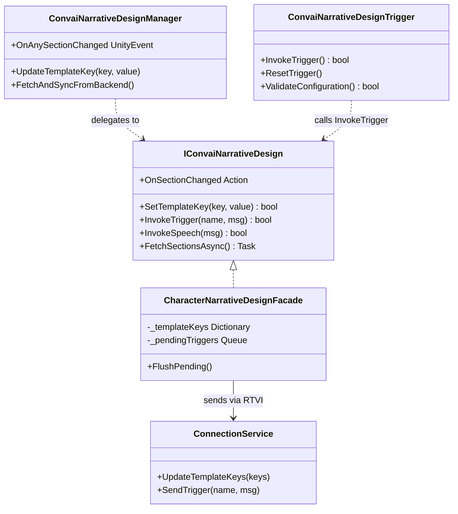

# Scripting Narrative Design

## Controlling Narrative Design Programmatically

The Inspector workflow covers the majority of use cases. This page documents the full C# surface for situations where you need programmatic control — dynamic character switching, async data fetching at runtime, runtime-generated narrative flows, or deep integration with your own game systems.

All of the capabilities described here are available through `IConvaiNarrativeDesign`, which is exposed on every `ConvaiCharacter` via the `NarrativeDesign` property. `ConvaiNarrativeDesignManager` and `ConvaiNarrativeDesignTrigger` both delegate to this interface internally, so everything you configure in the Inspector is also reachable from code.

## Accessing the Character API

Every `ConvaiCharacter` exposes a `NarrativeDesign` property that returns an `IConvaiNarrativeDesign` implementation:

```csharp
ConvaiCharacter character = GetComponent<ConvaiCharacter>();
IConvaiNarrativeDesign narrative = character.NarrativeDesign;
```

### Properties

| Property             | Type                                  | Description                                                                                                                                     |
| -------------------- | ------------------------------------- | ----------------------------------------------------------------------------------------------------------------------------------------------- |
| `TemplateKeys`       | `IReadOnlyDictionary<string, string>` | Snapshot of all template keys currently tracked for this character.                                                                             |
| `CurrentSectionId`   | `string`                              | The section ID most recently received from the backend. Empty string if no section has been received yet.                                       |
| `CurrentSectionData` | `NarrativeSectionData`                | Full section payload. Contains `SectionId`, `BehaviorTreeCode`, and `BehaviorTreeConstants`. `null` until the first section change is received. |

## Listening to Section Changes

Subscribe to these events in `OnEnable` and unsubscribe in `OnDisable` to avoid stale listeners after a component is disabled or destroyed.

```csharp
private void OnEnable()
{
    character.NarrativeDesign.OnSectionChanged     += HandleSectionChanged;
    character.NarrativeDesign.OnSectionDataReceived += HandleSectionData;
}

private void OnDisable()
{
    character.NarrativeDesign.OnSectionChanged     -= HandleSectionChanged;
    character.NarrativeDesign.OnSectionDataReceived -= HandleSectionData;
}

private void HandleSectionChanged(string previousId, string newId)
{
    Debug.Log($"Section: {previousId} → {newId}");
}

private void HandleSectionData(NarrativeSectionData data)
{
    Debug.Log($"Section ID: {data.SectionId}");
    // data.BehaviorTreeCode and data.BehaviorTreeConstants available here
}
```

### Events

| Event                   | Signature                                  | Description                                                                                |
| ----------------------- | ------------------------------------------ | ------------------------------------------------------------------------------------------ |
| `OnSectionChanged`      | `Action<string, string>`                   | Fires on every section transition. Parameters: `previousId`, `newId`.                      |
| `OnSectionDataReceived` | `Action<NarrativeSectionData>`             | Fires on every section transition with the full payload.                                   |
| `OnTriggerInvoked`      | `Action<ConvaiNarrativeTriggerInvocation>` | Fires after a trigger or speech request is accepted locally (before backend confirmation). |


`OnSectionChanged` and `OnSectionDataReceived` are delivered via the SDK's internal `EventHub`. If your subscription runs code that touches Unity API (e.g., `GameObject.SetActive`), ensure the `ConvaiNarrativeDesignManager` is in the scene — it uses main-thread delivery automatically. Raw subscriptions to `IConvaiNarrativeDesign` events may arrive on a background thread depending on configuration.


## Invoking Triggers from Code

```csharp
// Named trigger — advances the graph along a specific edge
bool accepted = character.NarrativeDesign.InvokeTrigger("CheckpointReached");

// Named trigger with an optional message payload
character.NarrativeDesign.InvokeTrigger("ItemInspected", "The fire extinguisher is missing its pin.");
```

`InvokeTrigger` returns `false` if both `triggerName` and `triggerMessage` are empty, or if the trigger is rejected internally. Otherwise it returns `true` and queues the trigger if the session is not yet open.

## Controlling What the Character Says

`InvokeSpeech` gives you direct control over the character's next utterance without advancing the narrative graph. It has two distinct modes depending on whether you wrap the message in `<speak>` tags.

### Context Injection (plain text)

Pass a plain string to make the character _aware_ of a piece of information. The character absorbs the context and responds in its own words — the exact phrasing is up to the AI.

```csharp
// Character becomes aware of this fact and responds naturally
character.NarrativeDesign.InvokeSpeech("The trainee just completed the evacuation drill.");
```

Use this when you want the character to react to a game event in a natural, conversational way rather than reading from a script.

### Verbatim Speech (speak tags)

Wrap the message in `<speak>` tags to make the character say that exact text word for word.

```csharp
// Character says this sentence verbatim
character.NarrativeDesign.InvokeSpeech("<speak>Attention: the fire exit on level two is now unlocked.</speak>");
```

Use this for announcements, scripted lines, safety alerts, or any moment where the exact wording matters.

### Comparison

| Pattern                               | What the character does                                 |
| ------------------------------------- | ------------------------------------------------------- |
| `InvokeSpeech("text")`                | Becomes aware of the context, responds in its own words |
| `InvokeSpeech("<speak>text</speak>")` | Says that exact text verbatim                           |


`InvokeSpeech` does not advance the narrative graph regardless of which mode you use. To advance the graph at the same time as sending a message, use `InvokeTrigger` with a named trigger.


### Listening to Trigger Invocations

```csharp
character.NarrativeDesign.OnTriggerInvoked += invocation =>
{
    Debug.Log($"Trigger: {invocation.TriggerName}, Queued: {invocation.Queued}");
};
```

`ConvaiNarrativeTriggerInvocation` fields:

| Field            | Type     | Description                                                              |
| ---------------- | -------- | ------------------------------------------------------------------------ |
| `TriggerName`    | `string` | The trigger name that was sent (empty for speech).                       |
| `TriggerMessage` | `string` | The optional message payload.                                            |
| `Queued`         | `bool`   | `true` if the trigger was deferred because the session was not yet open. |

## Template Keys via Code

```csharp
// Set a single key
character.NarrativeDesign.SetTemplateKey("PlayerName", "Alex");

// Set multiple keys
character.NarrativeDesign.SetTemplateKeys(new Dictionary<string, string>
{
    { "PlayerName",  "Alex" },
    { "ScoreLevel",  "Intermediate" }
});
```

Both methods send immediately if the session is open, or queue for the next connection if it is not.

The character-level API and `ConvaiNarrativeDesignManager`'s methods converge on the same transport internally. Use the Manager's methods when you want the keys visible and editable in the Inspector; use the character API for purely code-driven flows where Inspector visibility is not needed.

## Fetching Sections and Triggers Programmatically

### Via the Character API

```csharp
NarrativeFetchResult<List<NarrativeSectionInfo>> result =
    await character.NarrativeDesign.FetchSectionsAsync();

if (result.Success)
{
    foreach (NarrativeSectionInfo section in result.Data)
        Debug.Log($"{section.SectionId}: {section.SectionName}");
}
else
{
    Debug.LogError(result.Error);
}
```

```csharp
NarrativeFetchResult<List<NarrativeTriggerInfo>> result =
    await character.NarrativeDesign.FetchTriggersAsync();

foreach (NarrativeTriggerInfo trigger in result.Data)
    Debug.Log($"{trigger.TriggerName} → {trigger.DestinationSection}");
```

`NarrativeSectionInfo` fields: `SectionId`, `SectionName`.

`NarrativeTriggerInfo` fields: `TriggerId`, `TriggerName`, `TriggerMessage`, `DestinationSection`.

### Via the Static Fetcher

`NarrativeDesignFetcher` provides the same data without needing a character component reference — useful in Editor tooling or loading screens:

```csharp
// Fetch sections
FetchResult<List<SectionData>> sections =
    await NarrativeDesignFetcher.FetchSectionsAsync(characterId);

// Fetch triggers
FetchResult<List<TriggerData>> triggers =
    await NarrativeDesignFetcher.FetchTriggersAsync(characterId);

// Fetch both in parallel
var (sectionsResult, triggersResult) =
    await NarrativeDesignFetcher.FetchAllAsync(characterId);
```

`FetchResult<T>` fields:

| Field     | Type     | Description                                          |
| --------- | -------- | ---------------------------------------------------- |
| `Success` | `bool`   | `true` if the request succeeded.                     |
| `Data`    | `T`      | The fetched data. `default` if `Success` is `false`. |
| `Error`   | `string` | Error message. `null` if `Success` is `true`.        |

## Resetting State

```csharp
// Reset controller state only (clears CurrentSectionID and CurrentSectionData)
// Does NOT touch the section configs list or Unity Event wiring
narrativeManager.ResetController();

// Clear all section configs permanently (removes all UnitySectionEventConfig entries)
// Use only when switching to a completely different character
narrativeManager.ClearAllSectionConfigs();
```


`ClearAllSectionConfigs()` removes all `UnitySectionEventConfig` entries and all Unity Event wiring. This cannot be undone at runtime. Call it only when you have confirmed you are switching to a different character and no longer need the existing section event bindings.


## Reconfiguring ConvaiNarrativeDesignTrigger from Code

All Inspector-configurable settings have corresponding setter methods:

```csharp
ConvaiNarrativeDesignTrigger trigger = GetComponent<ConvaiNarrativeDesignTrigger>();

// Override trigger selection
trigger.SetTrigger("trigger-uuid", "CheckpointA", "Player reached checkpoint A");

// Change activation mode at runtime
trigger.SetActivationMode(TriggerActivationMode.Proximity);
trigger.SetProximityRadius(5f);

// Provide a known player transform (useful when auto-find is insufficient)
trigger.SetPlayerTransform(playerController.transform);

// Switch the target character
trigger.SetCharacter(otherCharacter.GetComponent<IConvaiCharacterAgent>());

// Validate before a critical trigger
if (!trigger.ValidateConfiguration())
{
    foreach (string warning in trigger.ValidationWarnings)
        Debug.LogWarning(warning);
}
```

## Architecture Overview



## Conclusion

`IConvaiNarrativeDesign` exposes the full Narrative Design surface in code — trigger invocation, speech injection, template key control, async data fetching, and real-time section change events — so you can integrate it into any architecture without being tied to the Inspector components. For complete worked examples composing these APIs into real scenarios, see [Usage Examples](usage-examples.md). For diagnosing problems, see Troubleshooting & Diagnostics.
