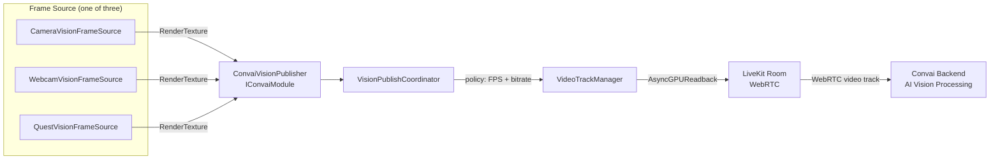

# Vision

## Real-Time Scene Vision for Convai Characters

Vision gives Convai characters the ability to see what is happening inside your Unity scene. When Vision is active, a continuous video stream is captured from a configurable source — a scene camera, a physical webcam, or the passthrough feed of a Meta Quest headset — and published to the Convai, where it is processed alongside the character's conversation context. Characters can then respond to what they observe, describe objects, flag hazards, or guide users based on live visual input.

Vision is a module-level feature that depends on `ConvaiRoomManager` operating in **Video** connection mode. On native platforms the video stream is sourced from a `RenderTexture`; on WebGL it is sourced from the visible browser canvas via `canvas.captureStream()`.

## How Vision Fits into the SDK

On WebGL the `ConvaiVisionPublisher` bypasses the frame source entirely and publishes the browser canvas directly. The rest of the pipeline is identical.

## Key Concepts

| Concept             | What it means                                                                                                                                                              |
| ------------------- | -------------------------------------------------------------------------------------------------------------------------------------------------------------------------- |
| **Frame Source**    | A `MonoBehaviour` that captures frames and exposes them as a Y-flipped `RenderTexture`. Three built-in implementations cover cameras, webcams, and Meta Quest passthrough. |
| **Publish Policy**  | Controls the client-side frame rate and bitrate used when streaming to the backend. Does not control which AI model or provider is used on the backend.                    |
| **Video Track**     | A WebRTC video track published to the active Convai room. Identified by the **Video Track Name** field (default `"unity-scene"`).                                          |
| **Room Connection** | Vision only publishes when `ConvaiRoomManager` is connected with `Connection Type` set to `Video`. Audio-only connections do not carry video.                              |

## What Goes Where

Understanding which component belongs where prevents the most common setup mistakes.

| Component                 | Where to place it                         | Notes                                        |
| ------------------------- | ----------------------------------------- | -------------------------------------------- |
| `ConvaiRoomManager`       | Any persistent scene GameObject           | **Connection Type** must be set to **Video** |
| `ConvaiVisionPublisher`   | Any persistent scene GameObject           | Typically placed on or near the NPC's root   |
| `CameraVisionFrameSource` | Same or child GameObject as the publisher | One per capture source                       |
| `WebcamVisionFrameSource` | Same or child GameObject as the publisher | One per capture source                       |
| `QuestVisionFrameSource`  | Same or child GameObject as the publisher | Meta Quest only; requires Meta XR SDK        |
| `VisionDebugPreview`      | Any scene GameObject                      | Editor-only; auto-disabled in player builds  |

## Prerequisites


Vision requires `ConvaiRoomManager.Connection Type` to be set to **Video**. If it is set to `Audio`, the publisher will remain idle even if all other components are correctly configured.


## Platform Behaviour

| Platform           | Supported frame sources                              | Notes                                                                                         |
| ------------------ | ---------------------------------------------------- | --------------------------------------------------------------------------------------------- |
| PC / Mac / Console | `CameraVisionFrameSource`, `WebcamVisionFrameSource` | Full RenderTexture pipeline                                                                   |
| Android / iOS      | `CameraVisionFrameSource`, `WebcamVisionFrameSource` | Webcam source requests camera permission at startup                                           |
| WebGL              | _(Canvas, automatic)_                                | `canvas.captureStream()` path — no frame source component needed; frame rate capped at 15 fps |
| Meta Quest         | `QuestVisionFrameSource`                             | Requires Meta XR SDK; bound to `PassthroughCameraAccess` via reflection                       |

## In This Section

<table data-view="cards"><thead><tr><th></th><th></th></tr></thead><tbody><tr><td><strong>Quick Start</strong></td><td>Get a character receiving a live camera feed with a step-by-step Inspector walkthrough — no code required.</td></tr><tr><td><strong>Frame Sources</strong></td><td>Configure CameraVisionFrameSource, WebcamVisionFrameSource, and QuestVisionFrameSource for every platform and use case.</td></tr><tr><td><strong>Publishing &#x26; Policies</strong></td><td>Choose a publish policy, tune frame rate and bitrate, and control the video track lifecycle.</td></tr><tr><td><strong>Debug Preview</strong></td><td>Visualise the active frame source as an on-screen overlay and monitor capture health in the Editor.</td></tr><tr><td><strong>Usage Examples</strong></td><td>End-to-end examples for safety training, equipment onboarding, VR walkthroughs, and manual-trigger sessions.</td></tr><tr><td><strong>Advanced Topics</strong></td><td>Scripting API, custom IVisionFrameSource, domain events, WebGL deep dive, and platform compatibility matrix.</td></tr><tr><td><strong>Troubleshooting &#x26; Diagnostics</strong></td><td>Diagnose publishing failures, blank feeds, permission errors, and platform-specific issues with a structured checklist and decision tree.</td></tr></tbody></table>

## Conclusion

Vision connects your Unity scene directly to the character's perception, enabling responses grounded in what the character can see. Start with the Quick Start to get a working stream from a scene camera, then use Frame Sources to select the right capture method for your platform and use case.
