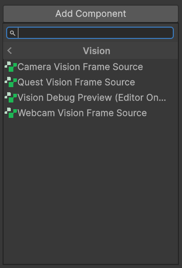
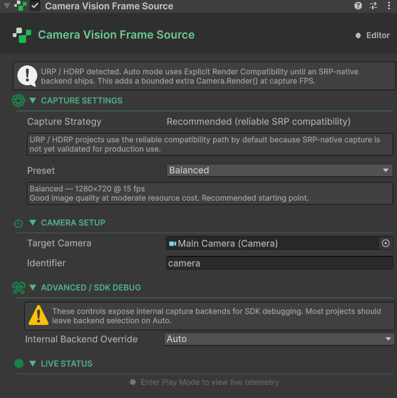
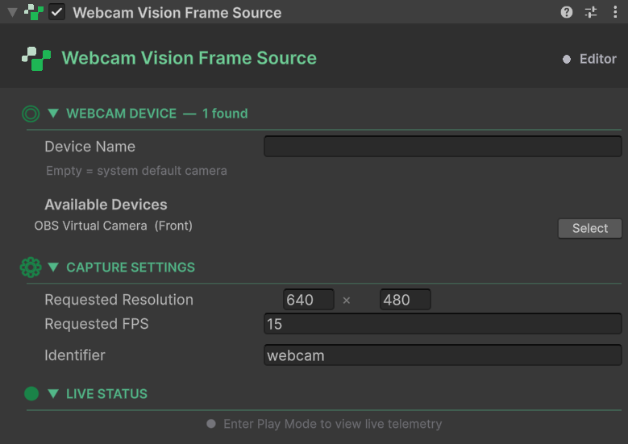
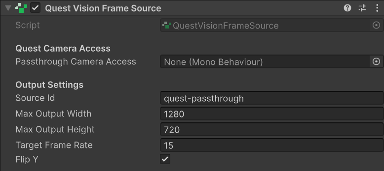

# Frame Sources

## Choosing and Configuring a Vision Frame Source

A frame source is the component responsible for capturing images and making them available to the publisher as a Y-flipped `RenderTexture`. The Convai SDK ships three built-in frame sources — one for Unity scene cameras, one for physical webcams, and one for the Meta Quest passthrough camera — each optimised for its target platform. This page covers how to add, configure, and troubleshoot all three.

### Selecting a Frame Source

| Frame source              | Best for                                                                             | Platforms                         |
| ------------------------- | ------------------------------------------------------------------------------------ | --------------------------------- |
| `CameraVisionFrameSource` | Streaming any Unity scene camera — main camera, security camera, overhead view       | PC, Mac, Android, iOS, console    |
| `WebcamVisionFrameSource` | Streaming a physical camera device attached to the player's machine or mobile device | PC, Mac, Android, iOS             |
| `QuestVisionFrameSource`  | Streaming the real-world passthrough feed on a Meta Quest headset                    | Meta Quest (requires Meta XR SDK) |

Add a frame source via **Add Component** and type the class name, or navigate the component menu under **Convai → Vision**.

<figure><figcaption></figcaption></figure>

***

## CameraVisionFrameSource

`CameraVisionFrameSource` captures a Unity `Camera`'s output into a `RenderTexture` and provides it to the publisher on every frame. It automatically selects the correct capture backend for the active render pipeline (built-in or SRP/URP) when **Camera Capture Mode** is set to `Auto`.

**Component menu path:** `Convai/Vision/Camera Vision Frame Source`&#x20;

<figure><figcaption></figcaption></figure>

### Inspector Reference

#### Capture Settings

<table><thead><tr><th width="169.49993896484375">Field</th><th width="178.5">Type</th><th width="103.5">Default</th><th>Description</th></tr></thead><tbody><tr><td><strong>Capture Preset</strong></td><td><code>CapturePreset</code></td><td><code>Balanced</code></td><td>Selects a preconfigured resolution and frame-rate combination. Set to <code>Custom</code> to enter values manually.</td></tr><tr><td><strong>Capture Width</strong></td><td><code>int</code></td><td>—</td><td>Output width in pixels. Active only when preset is <code>Custom</code>.</td></tr><tr><td><strong>Capture Height</strong></td><td><code>int</code></td><td>—</td><td>Output height in pixels. Active only when preset is <code>Custom</code>.</td></tr><tr><td><strong>Target Fps</strong></td><td><code>int</code></td><td>—</td><td>Target capture frame rate. Active only when preset is <code>Custom</code>.</td></tr><tr><td><strong>Camera Capture Mode</strong></td><td><code>CameraCaptureMode</code></td><td><code>Auto</code></td><td>Selects the render-pipeline capture strategy. Leave at <code>Auto</code> unless directed otherwise.</td></tr></tbody></table>

#### Camera

| Field             | Type     | Default           | Description                                                                 |
| ----------------- | -------- | ----------------- | --------------------------------------------------------------------------- |
| **Target Camera** | `Camera` | _(auto-resolved)_ | The camera to capture. If left blank, resolved to `Camera.main` at runtime. |

#### Debug

<table><thead><tr><th width="196.50006103515625">Field</th><th width="95.00006103515625">Type</th><th width="98.5">Default</th><th>Description</th></tr></thead><tbody><tr><td><strong>Source Id</strong></td><td><code>string</code></td><td><code>"camera"</code></td><td>An identifier used in domain events and multi-source scenarios.</td></tr><tr><td><strong>Enable Diagnostic Frame Health Probe</strong></td><td><code>bool</code></td><td><code>false</code></td><td>Performs a synchronous per-frame pixel readback to validate frame content. Use only when diagnosing black-frame issues; incurs GPU readback cost every frame.</td></tr></tbody></table>

### Capture Preset Values

<table><thead><tr><th width="124.99993896484375">Preset</th><th width="105.5">Width</th><th width="102">Height</th><th width="100.49993896484375">FPS</th><th>Use case</th></tr></thead><tbody><tr><td><code>LowOverhead</code></td><td>640</td><td>480</td><td>10</td><td>High-volume deployments, mobile, or bandwidth-constrained environments</td></tr><tr><td><code>Balanced</code></td><td>1280</td><td>720</td><td>15</td><td>General purpose — default for most scenarios</td></tr><tr><td><code>HighDetail</code></td><td>1920</td><td>1080</td><td>30</td><td>Scenes where fine visual detail is important to AI comprehension</td></tr><tr><td><code>Custom</code></td><td><em>(set manually)</em></td><td><em>(set manually)</em></td><td><em>(set manually)</em></td><td>Full control over dimensions and frame rate</td></tr></tbody></table>

### Camera Capture Mode Values

<table><thead><tr><th width="262">Mode</th><th>When to use</th></tr></thead><tbody><tr><td><code>Auto</code></td><td>Default. Detects the active render pipeline and selects the appropriate backend automatically.</td></tr><tr><td><code>BuiltInHooks</code></td><td>Forces use of <code>Camera.onPreRender</code> / <code>Camera.onPostRender</code> callbacks. Only compatible with the Built-in Render Pipeline.</td></tr><tr><td><code>SrpNative</code></td><td>Forces the SRP/URP explicit render path (<code>TargetCamera.Render()</code> in <code>LateUpdate</code>). Use when <code>Auto</code> fails to detect SRP correctly.</td></tr><tr><td><code>ExplicitRenderCompatibility</code></td><td>A compatibility fallback that explicitly renders the camera. Useful for highly customised render setups.</td></tr></tbody></table>


Leave **Camera Capture Mode** at `Auto` unless you have a specific reason to override it. Selecting the wrong backend for your render pipeline will result in a black or blank video feed.



**Enable Diagnostic Frame Health Probe** performs a synchronous GPU-to-CPU pixel readback every frame. Enable it only during debugging and disable it before shipping. In production, the SDK performs lighter-weight frame health checks internally.


***

## WebcamVisionFrameSource

`WebcamVisionFrameSource` captures a physical camera device using Unity's `WebCamTexture` API and converts the output to a `RenderTexture`. It handles device selection, permission requests (on Android and iOS), automatic rotation correction, and resolution clamping.

**Component menu path:** `Convai/Vision/Webcam Vision Frame Source`&#x20;

<figure><figcaption></figcaption></figure>

### Inspector Reference

#### Webcam Settings

<table><thead><tr><th width="206.00006103515625">Field</th><th width="82.49993896484375">Type</th><th width="74.00006103515625">Default</th><th>Description</th></tr></thead><tbody><tr><td><strong>Webcam Device Name</strong></td><td><code>string</code></td><td><code>""</code></td><td>Name of the webcam device to open. An empty string selects the first available device.</td></tr><tr><td><strong>Requested Width</strong></td><td><code>int</code></td><td><code>640</code></td><td>Requested capture width sent to the driver. The actual resolution may differ.</td></tr><tr><td><strong>Requested Height</strong></td><td><code>int</code></td><td><code>480</code></td><td>Requested capture height sent to the driver.</td></tr><tr><td><strong>Requested Fps</strong></td><td><code>int</code></td><td><code>15</code></td><td>Requested frame rate sent to the driver.</td></tr><tr><td><strong>Max Output Width</strong></td><td><code>int</code></td><td><code>1280</code></td><td>Maximum width of the output <code>RenderTexture</code>. Frames wider than this are scaled down. Set to <code>0</code> to disable scaling.</td></tr><tr><td><strong>Max Output Height</strong></td><td><code>int</code></td><td><code>720</code></td><td>Maximum height of the output <code>RenderTexture</code>.</td></tr></tbody></table>

#### Source Identification

<table><thead><tr><th width="109.5">Field</th><th width="82.9998779296875">Type</th><th width="101.5">Default</th><th>Description</th></tr></thead><tbody><tr><td><strong>Source Id</strong></td><td><code>string</code></td><td><code>"webcam"</code></td><td>Identifier used in domain events and multi-source scenarios.</td></tr></tbody></table>

### Listing Available Devices

To enumerate connected webcam devices at runtime:

```csharp
string[] deviceNames = WebcamVisionFrameSource.GetAvailableDeviceNames();
foreach (string name in deviceNames)
    Debug.Log(name);
```

### Switching Devices at Runtime

To switch to a different webcam without stopping the session:

```csharp
// Requires a reference to the WebcamVisionFrameSource component
WebcamVisionFrameSource webcam = GetComponent<WebcamVisionFrameSource>();
IConvaiOperation<Unit> op = webcam.SwitchWebcamAsync("Front Camera");
```

### Permission Flow (Android / iOS)

On Android and iOS the component requests camera permission asynchronously when `StartCapture()` is called. The `State` property transitions through:

`Idle → AwaitingPermission → Starting → Ready`

If the user denies permission, `State` becomes `Failed` and `ErrorKind` is set to `PermissionDenied`. You can monitor this via `IVisionFrameSourceStatusProvider.StatusChanged` — see [Advanced Topics](advanced-topics.md) for details.


On Android and iOS the system camera permission dialog appears the first time `StartCapture()` runs. Ensure your app's manifest or `Info.plist` declares the camera usage description before shipping.


***

## QuestVisionFrameSource

`QuestVisionFrameSource` streams the real-world passthrough feed from a Meta Quest headset, giving Convai characters a live view of the physical environment the user is standing in. The component binds to Meta's `PassthroughCameraAccess` API via reflection so that the SDK does not take a hard compile-time dependency on the Meta XR package.

**Component menu path:** `Convai/Vision/Quest Vision Frame Source`&#x20;

<figure><figcaption></figcaption></figure>

### Inspector Reference

#### Quest Camera Access

<table><thead><tr><th width="159">Field</th><th width="150.49993896484375">Type</th><th width="162.5">Default</th><th>Description</th></tr></thead><tbody><tr><td><strong>Passthrough Camera Access</strong></td><td><code>MonoBehaviour</code></td><td><em>(auto-discovered)</em></td><td>Reference to a <code>PassthroughCameraAccess</code> component in the scene. Leave blank to auto-find.</td></tr></tbody></table>

#### Output Settings

<table><thead><tr><th width="178.5">Field</th><th width="95.5">Type</th><th width="191.5">Default</th><th>Description</th></tr></thead><tbody><tr><td><strong>Source Id</strong></td><td><code>string</code></td><td><code>"quest-passthrough"</code></td><td>Identifier used in domain events.</td></tr><tr><td><strong>Max Output Width</strong></td><td><code>int</code></td><td><code>1280</code></td><td>Maximum width of the output <code>RenderTexture</code>.</td></tr><tr><td><strong>Max Output Height</strong></td><td><code>int</code></td><td><code>720</code></td><td>Maximum height of the output <code>RenderTexture</code>.</td></tr><tr><td><strong>Target Frame Rate</strong></td><td><code>int</code></td><td><code>15</code></td><td>Target frames per second for capture.</td></tr><tr><td><strong>Flip Y</strong></td><td><code>bool</code></td><td><code>true</code></td><td>Flips the passthrough texture vertically. Required for correct video orientation; disable only if the Meta SDK changes its coordinate conventions.</td></tr></tbody></table>


`QuestVisionFrameSource` requires the **Meta XR SDK** to be installed. On non-Quest platforms the component enters the `Failed` state with `ErrorKind` set to `UnsupportedPlatform` and produces no frames.



The binding to `PassthroughCameraAccess` is established via reflection at runtime. If the Meta XR package is updated and `PassthroughCameraAccess` changes its API, the component will log an error and enter `Failed` state. Check for SDK updates in that case.


***

## Source State Reference

All three frame sources implement `IVisionFrameSourceStatusProvider`, which exposes a `State` property and a `StatusChanged` event.

### VisionSourceState

<table><thead><tr><th width="197.50006103515625">State</th><th>Meaning</th></tr></thead><tbody><tr><td><code>Idle</code></td><td>Capture has not been started.</td></tr><tr><td><code>AwaitingPermission</code></td><td>Waiting for the user to grant camera permission (Android / iOS).</td></tr><tr><td><code>Starting</code></td><td>Capture is initialising — device is opening, RenderTextures are being created.</td></tr><tr><td><code>Ready</code></td><td>Capture is running and frames are being produced.</td></tr><tr><td><code>Degraded</code></td><td>Capture is running but frame health checks are detecting issues (e.g., consecutive blank frames).</td></tr><tr><td><code>Stopped</code></td><td>Capture was stopped normally.</td></tr><tr><td><code>Failed</code></td><td>Capture failed and cannot continue. Check <code>ErrorKind</code> and <code>StatusMessage</code> for details.</td></tr></tbody></table>

### VisionSourceErrorKind

<table><thead><tr><th width="211.5">Error kind</th><th>Cause</th></tr></thead><tbody><tr><td><code>None</code></td><td>No error.</td></tr><tr><td><code>Timeout</code></td><td>The source did not produce a usable frame within the expected time window.</td></tr><tr><td><code>PermissionDenied</code></td><td>Camera permission was denied by the user or the OS.</td></tr><tr><td><code>UnsupportedPlatform</code></td><td>The source is not supported on this platform (e.g., <code>QuestVisionFrameSource</code> on PC).</td></tr><tr><td><code>DeviceUnavailable</code></td><td>The requested camera device could not be opened.</td></tr><tr><td><code>InvalidConfiguration</code></td><td>A field value is out of range or inconsistent (check <code>StatusMessage</code>).</td></tr><tr><td><code>Unknown</code></td><td>An unexpected error occurred.</td></tr></tbody></table>

For scripting against these states and responding to `StatusChanged` events, see [Advanced Topics](advanced-topics.md).

## Conclusion

Each frame source targets a specific platform and capture scenario — use `CameraVisionFrameSource` for Unity scene cameras, `WebcamVisionFrameSource` for physical devices on desktop and mobile, and `QuestVisionFrameSource` for Meta Quest passthrough. With your frame source configured and in the `Ready` state, proceed to [Publishing & Policies](publishing-and-policies.md) to control how and when frames are sent to the Convai backend.
