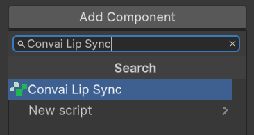

# Adding Lip Sync to Your Character

## Introduction

The **Convai Lip Sync** component enables real-time facial animation by driving your character’s blendshapes directly from live speech output. Powered by Convai’s neural animation system, **NeuroSync**, it processes the live audio stream in real time to generate accurate, low-latency lip movement and expressive facial motion.

Whether you are using a standard blendshape-based character or a high-fidelity rig such as MetaHuman, the workflow remains lightweight and developer-friendly. By selecting the correct blendshape profile and mapping asset, you can quickly achieve natural lip synchronization that remains visually aligned with audio during interactive, voice-driven conversations.

***

## Prerequisites

Before adding Lip Sync, ensure:

* Your character already includes the **Convai Character** component.
* Your character uses at least one **SkinnedMeshRenderer** with blendshapes.
* The blendshape structure matches one of the supported profiles.
  * ARKit
  * CC4 Extended
  * MetaHuman

***



### Add the Lip Sync Component

1. Select your character in the **Hierarchy**.
2. In the **Inspector**, click **Add Component**.
3. Search for **Convai Lip Sync**.
4. Add the component to your character.

The Lip Sync panel will now appear in the Inspector.

<figure><figcaption></figcaption></figure>



### Assign Target Meshes

Lip Sync requires at least one mesh with blendshapes.

If no mesh is assigned, you will see a **Target Mesh Required** warning.

To automatically assign compatible meshes:

* Click **Auto-Find** in the warning message\
  or
* Click **Auto-Find** inside the **Target Meshes** section

The system will scan your character and assign available blendshape-enabled meshes automatically.

You may also manually assign meshes if needed.

<figure><figcaption></figcaption></figure>



### Select the Blendshape Profile

Under **Core Setup**, choose the appropriate **Profile** based on your character’s blendshape structure.

Supported profiles include:

* ARKit
* CC4 Extended
* MetaHuman

Select the profile that matches how your character’s facial blendshapes are structured.

<figure><figcaption></figcaption></figure>



### Assign a Mapping Asset

After selecting a profile, you must assign a corresponding **Mapping Asset** from the **Mapping** field.

Convai provides default mapping assets for:

* ARKit
* CC4 Extended
* MetaHuman

If you do not see the mapping assets:

1. Open the mapping selection window.
2. Click the visibility filter in the top-right corner.
3. Enable hidden or package assets visibility.

This ensures that assets stored inside Unity Packages become visible.

Once a mapping asset is selected, the Lip Sync setup is complete.

<figure><figcaption></figcaption></figure>



***

## Playback & Behavior Settings

The **Playback & Behavior** section allows you to fine-tune facial animation behavior.

### Lip Smoothing

Reduces high-frequency jitter in lip movements.

### Fade Transition

Controls the duration of the blend back to the neutral pose in seconds.

### A/V Sync Offset

Fine-tunes audio-visual synchronization in seconds.

These settings help balance realism, responsiveness, and stylistic expression.

<figure><figcaption></figcaption></figure>

***

## Streaming & Latency Settings

The **Streaming & Latency** section controls how Lip Sync behaves under different network conditions. Since lip animation is streamed alongside audio in real time, buffer strategy directly affects responsiveness and playback stability.

### Latency Mode

The **Latency Mode** dropdown provides predefined streaming strategies:

* **Balanced**\
  Recommended for most use cases. Provides a stable balance between playback smoothness and low delay.
* **Ultra Low Latency**\
  Minimizes delay as much as possible. Best suited for strong and stable network connections. May stutter on unstable connections.
* **Network Safe**\
  Prioritizes playback stability over responsiveness. Ideal for inconsistent or high-latency network environments.
* **Custom**\
  Enables manual control over buffering behavior.

<figure><figcaption></figcaption></figure>

When **Custom** is selected, two additional parameters become available:

#### Ring Buffer Cap (s)

Defines the maximum duration (in seconds) of upcoming lip sync data stored in memory.\
Higher values increase memory usage but provide stronger protection against network instability.

#### Resume Headroom (s)

Specifies the minimum data cushion (in seconds) required after a network interruption before playback resumes.\
Lower values feel more real-time but may result in stuttering on weaker connections.

For most production environments, **Balanced** mode is recommended unless you have specific performance requirements.

<figure><figcaption></figcaption></figure>

***

## Playback & Behavior Reminder

Lip Sync animation quality can vary depending on:

* The selected character model
* The blendshape structure
* The selected voice
* The speech tempo and phoneme distribution

You may need to fine-tune **Lip Smoothing**, **Fade Transition**, and **A/V Sync Offset** based on your character and voice combination to achieve optimal visual results.

There is no universal configuration that works perfectly for all characters. Adjust these settings according to your specific animation style and responsiveness goals.

***

## Live Status

The **Live Status** section provides real-time playback telemetry while the application is in Play Mode.

During runtime, you can monitor:

* **Played vs Buffered** segments
* **Elapsed Time**
* **Remaining Time**
* **Received Data**
* **Headroom (ms)**
* **Buffer Size (s)**
* **Is Talking** state

The visual playback bar shows:

* Green section representing played animation
* Blue section representing buffered upcoming animation

This telemetry is especially useful when optimizing latency settings or diagnosing network-related playback behavior. It allows you to directly observe how buffer size and headroom impact animation smoothness in real time.

<figure><figcaption></figcaption></figure>

***

## Conclusion

You have successfully added and configured Lip Sync for your Convai-powered character. With NeuroSync processing live audio in real time and proper blendshape mapping in place, your character can now deliver expressive, low-latency speech animation during interactive conversations.

As Convai continues expanding animation capabilities and backend optimizations, even more advanced facial expression and synchronization features will become available in future releases.


**Need help?** For questions, please visit the [**Convai Developer Forum**](https://forum.convai.com/).

