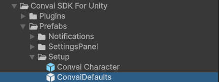

# Migration Guide

This guide explains how to migrate a Unity project from the old Convai SDK to the latest Convai SDK.


Important: Back Up Your Project

Before you begin, create a full backup of your Unity project to avoid accidental data loss.




### Remove the old Convai SDK

1. Open your Unity project.
2. In the Project window, go to `Assets`.
3. Locate the `Convai` folder from the old SDK.
4. Delete the entire folder.

After removal, Unity may show compile errors until all references are migrated.



### Install the latest Convai SDK

Install the newest SDK using one of the following:

#### Option A: Unity Asset Store

1. Open Unity Asset Store.
2. Search for `Convai SDK`.
3. Download and import the latest package.

#### Option B: Plugin Manager

1. Open Plugin Manager.
2. Install the latest Convai plugin.



### Set up API key

### Open the Convai Account window in Unity

In the Unity top menu, go to **Convai → Account**.

<figure><figcaption></figcaption></figure>

#### Copy your API Key from Convai

1. Open Convai in your browser and sign in.
2. Locate your **API Key** in the dashboard/profile settings.
3. Copy the API key.

<figure><figcaption></figcaption></figure>

#### Paste and update the key in Unity

* Paste the key into the **API Key** field.
* Click **Update API Key**.
* **Expected result:** Account details and usage information refresh successfully.

<figure><figcaption></figcaption></figure>



### Update scene setup

Update these key objects in your scene:

#### Replace Convai Essentials with ConvaiDefaults

1. Remove `ConvaiDefaults` from the scene.
2. Add `ConvaiDefaults` From "Convai SDK For Unity/Prefabs/Setup"

You can add it by either:

* Drag the `ConvaiDefaults` prefab from the Prefabs/Setup folder into the scene.
* Searching for `ConvaiDefaults` in the Project window and adding it manually.

<figure><figcaption></figcaption></figure>

#### Replace ConvaiNPC with ConvaiCharacter

1. Select each NPC character object.
2. Remove missing/legacy Convai components (if any).
3. Add the `Convai Character` component.

<figure><figcaption></figcaption></figure>

**Audio setup**

1. After adding `ConvaiCharacter`, use the setup button shown in the inspector.
2. This will automatically add/configure an `Audio Source` component.



### Lip Sync setup (optional)

If your character is humanoid and uses facial lip movement:

1. Select the character object.
2. Add the `Convai Lip Sync` component.
3. Configure visemes/blendshapes according to your avatar setup.

You can explore more about adding Lip Sync [Here](https://docs.convai.com/api-docs/plugins-and-integrations/unity-plugin-beta-overview/getting-started/setup/adding-lip-sync-to-your-character)


