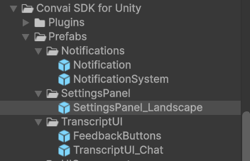

Use this page when moving additional Unity beta feature code to the current SDK architecture. Each section maps a legacy surface to the current component or API.

#### LTM (Session Resume)

No API migration is required. Continue enabling/disabling session resume as needed in your setup.

#### Dynamic Info: `DynamicInfoController` -> `ConvaiRoomManager`

Dynamic info APIs are now routed through `ConvaiRoomManager`.

```csharp
// Old
public class PlayerHealth : MonoBehaviour
{
    [SerializeField] private DynamicInfoController _dynamicInfoController;
    private int _health = 100;

    private void Start()
    {
        _dynamicInfoController.SetDynamicInfo("Player Health is " + _health);
        Debug.Log("Player Health is " + _health);
    }
}

// New
public class PlayerHealth : MonoBehaviour
{
    [SerializeField] private ConvaiRoomManager _convaiRoomManager;
    private int _health = 100;

    private void Start()
    {
        _convaiRoomManager.SendDynamicInfo("Player Health is " + _health);
        Debug.Log("Player Health is " + _health);
    }
}
```

***

### Narrative Design Migration (Legacy -> Current SDK)

Narrative Design is still supported, but references now align with the new SDK architecture (`ConvaiCharacter` + modular narrative components).\
Legacy setup reference: [Adding Narrative Design to your Character](https://docs.convai.com/api-docs/plugins-and-integrations/unity-plugin/adding-narrative-design-to-your-character).

#### Narrative quick mapping

* `ConvaiNPC` (old character component) -> `ConvaiCharacter`
* `Narrative Design Manager` (legacy setup) -> `Convai Narrative Design Manager` (`ConvaiNarrativeDesignManager`)
* `Narrative Design Trigger` (legacy setup) -> `Convai Narrative Design Trigger` (`ConvaiNarrativeDesignTrigger`)
* `InvokeSelectedTrigger(message)` -> `InvokeTrigger()` for saved triggers, or `convaiCharacter.NarrativeDesign.InvokeEvent(message)` for inline event context
* Direct saved-trigger calls are available through `convaiCharacter.NarrativeDesign.InvokeTrigger(triggerName)`

#### Narrative minimal migration steps



**Replace legacy NPC component references**

Replace legacy NPC component references with `ConvaiCharacter`.



**Add Convai Narrative Design Manager to character**

Add `Convai Narrative Design Manager` to the character object (or assign the character in the manager).



**Sync with backend**

Click **Sync with Backend** in the manager inspector to fetch sections for that character.



**Re-bind section events**

Re-bind section events (`On Section Start`, `On Section End`) in the manager.



**Add Narrative Design Trigger to trigger objects**

Add `Convai Narrative Design Trigger` to trigger objects and assign the same `ConvaiCharacter`.



**Fetch triggers and configure activation**

Click **Fetch** in the trigger inspector, select a trigger, and configure activation mode (Collision/Proximity/Manual/TimeBased).



#### Script migration example (trigger invoke)

```csharp
// Old
if (convaiNPC.TryGetComponent(out NarrativeDesignTrigger narrativeDesignTrigger))
{
    string message = "Player has collected enough resources";
    narrativeDesignTrigger.InvokeSelectedTrigger(message);
}

// New
if (convaiCharacter.TryGetComponent(out ConvaiNarrativeDesignTrigger narrativeDesignTrigger))
{
    narrativeDesignTrigger.InvokeTrigger();

    string message = "Player has collected enough resources";
    convaiCharacter.NarrativeDesign.InvokeEvent(message);
}
```

#### Notes

* Section/trigger lists are fetched per character ID, so always ensure the correct `ConvaiCharacter` is assigned before syncing/fetching.
* `InvokeTrigger()` sends only the configured saved trigger name.
* For fully code-driven flows, call `convaiCharacter.NarrativeDesign.InvokeTrigger(triggerName)`, `InvokeEvent(message)`, or `InvokeSpeech(text)` based on intent.

***

### Transcript UI Migration (Legacy Dynamic UI -> ChatTranscriptUI)

The transcript UI architecture changed from a direct push model to a view-model based flow.

#### What changed

* **Old model:** UI classes pushed text directly using `ConvaiChatUIHandler`, `ChatUIBase`, and `UIType`.
* **New model:** UI is a thin view implementing `ITranscriptUI`; routing/aggregation happens in controller and presentation strategy layers.
* **Result:** custom UI should mainly render `TranscriptViewModel`.

#### Quick mapping

* `ConvaiChatUIHandler` -> `TranscriptUIController` + presentation strategy
* Custom class derived from `ChatUIBase` -> `MonoBehaviour` implementing `ITranscriptUI`
* `SendCharacterText(...)` / `SendPlayerText(...)` -> `DisplayMessage(TranscriptViewModel viewModel)`
* Finalize message -> `CompleteMessage(string messageId)`
* Clear transcript/chat -> `ClearAll()`
* UI activation per type -> `Identifier` + `SetActive(bool active)`

#### Minimal migration steps



**Create a new script**

Create a new script (for example, `MyGameTranscriptUI.cs`).



**Use reference implementation**

Use `SDK/Runtime/Presentation/Views/Transcript/Chat/ChatTranscriptUI.cs` as reference.



**Implement interfaces**

Implement `MonoBehaviour` + `ITranscriptUI` (and `IInjectable` if service injection is needed).



**Keep required members**

Keep required members:

* `Identifier`
* `IsActive`
* `DisplayMessage(TranscriptViewModel viewModel)`
* `CompleteMessage(string messageId)`
* `ClearAll()`
* `SetActive(bool active)`
* `CompletePlayerTurn()`



**Inject services if needed**

If needed, inject services via `InjectServices(IServiceContainer container)`:

* `IConvaiCharacterLocatorService`
* `IPlayerInputService`



**Rewire prefab references**

Rewire prefab references (bubble prefab, container, input field, fade components) and assign the new component where transcript UIs are registered.



#### Important behavior notes

* In-progress messages are typically keyed by speaker while streaming.
* `CompleteMessage(messageId)` finalizes a bubble and removes it from the active in-progress map.
* Text submission generally flows through `IPlayerInputService`.
* Character colors are resolved through `IConvaiCharacterLocatorService`.

#### Common pitfall

If no transcript messages appear, verify:

* The UI is active (`SetActive(true)`).
* `Identifier` matches the transcript mode expected by your controller setup (for example, `"Chat"`).

***

### Prebuilt UI Prefabs

The new SDK includes prebuilt UI prefabs you can use directly or customize as needed:

* **Settings Panel Prefab**: `Packages/com.convai.convai-sdk-for-unity/Prefabs/SettingsPanel/SettingsPanel_Landscape.prefab`
* **Transcript Chat Prefab**: `Packages/com.convai.convai-sdk-for-unity/Prefabs/TranscriptUI/TranscriptUI_Chat.prefab`
* **Notification Prefab**: `Packages/com.convai.convai-sdk-for-unity/Prefabs/Notifications/Notification.prefab`

<figure><figcaption></figcaption></figure>

For teams migrating from the old SDK docs, this information was previously listed under [Convai UI Prefabs](https://docs.convai.com/api-docs/plugins-and-integrations/unity-plugin/utilities/convai-ui-prefabs).

***

### Migration Complete

After completing the steps above:

* Project uses the latest Convai SDK.
* NPC interaction runs through `ConvaiCharacter`.
* Scene defaults run through `ConvaiDefaults`.
* Transcript UI follows the new `ITranscriptUI` pipeline.

If you face issues after migration, check:

* Missing script references.
* API usage updates in your custom scripts.
* Audio source setup on character objects.
* Transcript UI activation and identifier matching.
