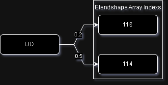
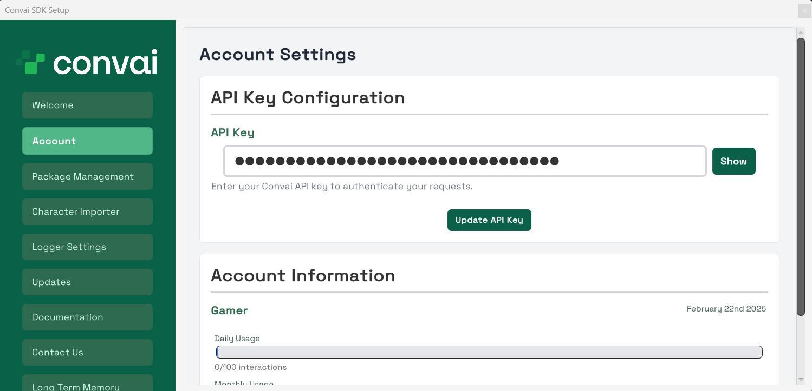
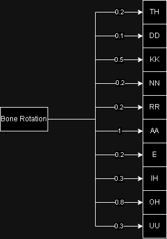

# Adding Lip-Sync to your Character

## Lip Sync System

Convai sends Visemes or Blend Shape Frame from back-end depending upon the face model developer chooses to use and when return Convai SDK out of the box extracts and parses it and provides it to the **`Convai LipSync Component`**, after which the component relies of the **`SkinMeshRen derer`**'s **`Blendshape Effectors`** and **`Bone Effectors`** to give Convai powered NPC's realistic lipsync.

### Components of LipSync System

#### Viseme Effector List

This is where developer will tell the Convai SDK, which index of Blendshape Array will be effector how much from which value. To better explain its working lets understand it with a diagram.

<figure><figcaption></figcaption></figure>

Here, its saying that whatever value is coming from the server will affect Blendshape at 116th index by 0.2 multiplier and Blendshape at 114th index by 0.5 multiplier. The engine representation of this would look something like this.

<figure><figcaption></figcaption></figure>

So, you can make you own Effector list or use one of the many that we ship in the SDK.

**How to Create your own Viseme Effector List**

Right click inside project panel and head over to **`Create > Convai > Expression > Viseme Skin Effector`** which will create a **Viseme Effector List Scriptable Object** and now you can define your own values

<figure><figcaption></figcaption></figure>

#### Viseme Bone Effector List

This is where developer will tell the Convai SDK, how much each value coming from server will affect the rotation of the bone. To better explain its working lets understand it with a diagram.&#x20;

<figure><figcaption></figcaption></figure>

Here, bone's rotation will be effect by the values coming from server multiplied by the values in effects. Example, for TH the value will affect bone's rotation by 0.2 multiplier and etc. The engine representation of this would look something like this.

<figure><figcaption></figcaption></figure>

So, you can make you own Bone Effector list or use one of the many that we ship in the SDK.

We use this formula to calucate the roatation

```csharp
UpdateJawBoneRotation(
new Vector3(
        0.0f, 
        0.0f, 
        -90.0f - CalculateBoneEffect(FacialExpressionData.JawBoneEffector) * 30f
    )
);
UpdateTongueBoneRotation(
new Vector3(
        0.0f,
        0.0f,
        CalculateBoneEffect(FacialExpressionData.TongueBoneEffector) * 80f - 5f
    )
);
```

**How to Create your own Viseme Bone Effector List**

Right click inside project panel and head over to **`Create > Convai > Expression > Viseme Bone Effector`** which will create a **Viseme Bone Effector List Scriptable Object** and now you can define your own values.

<figure><figcaption></figcaption></figure>

#### Convai Lipsync Component

When you attach this component to your Convai Character, you will see something like this. &#x20;

<figure><figcaption></figcaption></figure>

Let's learn what these learns are

1. Facial Expression Data
   1. Head | Teeth | Tongue
      1. Renderer: Skin Mesh Renderer which correspond to that specified part of the body
      2. Viseme Effectors List: How the SkinMeshRenderer's Blendshape will be affected by values coming from server.
   2. Jaw | Tongue Bone Effector
      1. How much Bone's rotation will be affected by values coming from server.
   3. Jaw | Tongue Bone
      1. Reference to the bone which control jaw and tongue respectively
2. Weight Blending Power
   1. Percentage to interpolate between two frames in late update.
3. Character Emotions
   1. Learn More about Character Emotions here [character-emotion.md](utilities/character-emotion.md "mention")

### Steps to add Lipsync to your Convai Character



1. Select you Convai Powered Character in the hierarchy.
2. In the inspector panel search for ConvaiNPC component, there you will see Add Component Button.
3. Click on it and select Convai Lipsync Component and click on apply

<figure><figcaption></figcaption></figure>



1. Select you Convai Powered Character in the hierarchy.
2. Click on Add Component
3. Search for Convai Lipsync
4. Select Convai Lipsync component

<figure><figcaption></figcaption></figure>



Now you can configure the Component according to your custom configuration or use one of the many Presets Convai ships with the SDK

<figure><figcaption></figcaption></figure>

Now your lipsync component would be ready to use in your application.
