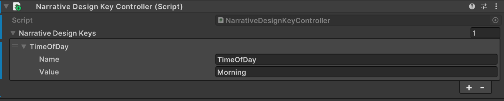
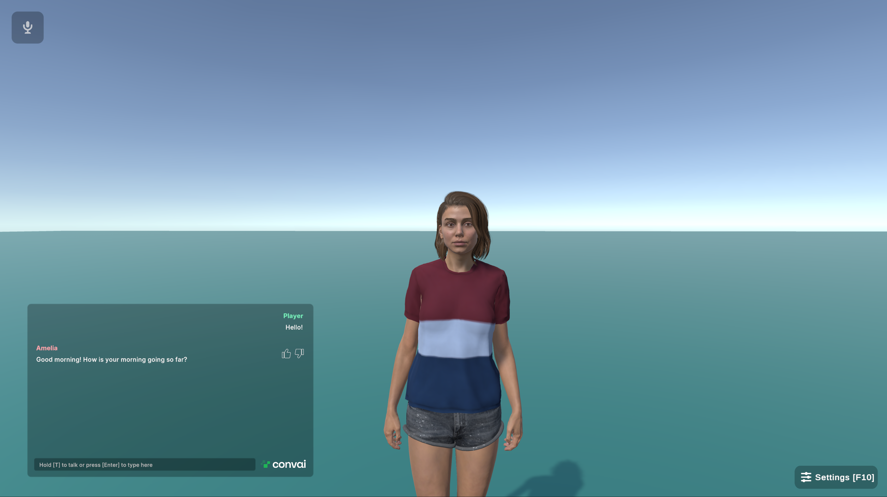

# Narrative Design Keys

We will create a simple scenario where the character welcomes the player and asks them about their evening or morning based on the player's time of day.

### Step 1

Activate the Narrative Design for your character in the Playground. Then, create a new Section.

### Step 2

In the Objective section of the new Section, add the following text:

`The time of day currently is {TimeOfDay}. Welcome the player and ask him how his {TimeOfDay} is going.`


Notice that any string placed between curly brackets becomes a variable. In this case, we are adding the time of day as a variable. From Unity, we can pass either the word "Morning" or "Evening," and the character will respond accordingly.


<figure><figcaption></figcaption></figure>

### Step 3

Now, let’s back to Unity and make the necessary adjustments. Click on your NPC.

Click the **Add Component** button and add the **Narrative Design Key Controller** Component.

### Step 4

In the **Name** field, enter **TimeOfDay**. In the **Value** field, specify the corresponding value for that variable, which could be **Morning**, **Evening**, or anything else you choose.

<figure><figcaption></figcaption></figure>

That’s it! Now let’s test it out. :tada::sunglasses:

<figure><figcaption></figcaption></figure>
