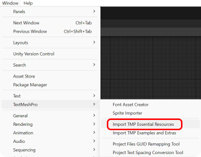
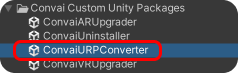

# Building for AR

## AR Installation

If you want to make your Convai Plugin compatible with AR, you can do so in two ways. Please see the instructions below or check out our [_latest tutorial video_](https://www.youtube.com/watch?v=j0l\_paOQxvI) on YouTube.



### Method 1 : Automatic Setup


Recommended for new projects.



The following processes will be performed:

* Universal Render Pipeline (URP)
* ARCore Plugin
* Convai Custom AR Package
* Convai URP Converter

**If these packages are not present, they will be installed.**



**If the target build platform is not Android, it will be switched to **_**Android.**_



Make sure to download the Android platform support from Unity Hub for your project's version.


1. Click on " _Convai / Convai Custom Package Installer / Install AR Package_ "

<figure><figcaption></figcaption></figure>

<figure><figcaption></figcaption></figure>

2. Confirm the changes and processes to be made. If you agree, the process will start.                     Click " **Yes, Proceed** " and the process will begin. You'll see logs in the console.

<figure><figcaption></figcaption></figure>

3. If you encounter an error like "Failed to Resolve Packages," don't worry. The process will continue, and the error will be resolved automatically after the package installations are complete.

<figure><figcaption></figcaption></figure>

4. Open the " _Convai / Scenes / Convai Demo - AR_ " demo scene. If the TMP Importer window appears ( It will appear if TMP Essentials is not installed in your project ), click " **Import TMP Essentials** " to install TextMeshPro Essentials for UI text objects.

<figure><figcaption></figcaption></figure>

Alternatively, you can use the " _Window / TextMeshPro / Import TMP Essential Resources_ " to install it.

<figure><figcaption></figcaption></figure>

5. After importing TMP Essentials, you can remove the empty GameObject in your scene that triggers the Prompt window to appear.

<figure><figcaption></figcaption></figure>

6. Build your project by going to " _File / Build Settings / Build_ " Ensure that the " **Convai Demo - AR** " scene is included in the Scenes in Build section.

<figure><figcaption></figcaption></figure>


Ensure you've set up your API Key. ( Convai / Convai Setup )


Now everything is ready for testing. 🙂✅

### Method 2 : Manual Setup&#x20;


Ensure you have the following packages installed in your project:

* ARCore
* URP (Universal Render Pipeline) - Recommended for optimization, though not mandatory


1. Double-click on " Convai / Convai Custom Unity Packages / ConvaiVRUpgrader.unitypackage "

<figure><figcaption></figcaption></figure>

2. You'll see a warning that the settings will overwrite your project settings. You can either allow it by clicking " **Import** " or create a temporary project by clicking " **Switch Project** "

<figure><figcaption></figcaption></figure>

3. In the Import Unity Package window, review the assets to be imported and click " **Next** "

<figure><figcaption></figcaption></figure>

4. Select all settings to be changed in the Project Settings and complete the installation by clicking    " **Import** "

<figure><figcaption></figcaption></figure>

5. Open the " _Convai / Scenes / Convai Demo - AR_ " demo scene. If the TMP Importer window appears ( It will appear if TMP Essentials is not installed in your project ), click " **Import TMP Essentials** " to install TextMeshPro Essentials for UI text objects.

<figure><figcaption></figcaption></figure>

Alternatively, you can use the " _Window / TextMeshPro / Import TMP Essential Resources_ " to install it.

<figure><figcaption></figcaption></figure>

6. After importing TMP Essentials, you can remove the empty GameObject in your scene that triggers the Prompt window to appear.

<figure><figcaption></figcaption></figure>

7. If you see 3D objects in pink, it's a shader issue. If you're using URP, convert the materials to URP by double-clicking on " _Convai / Convai Custom Unity Packages / ConvaiURPConverter_ " and importing all assets in the window that appears.

<figure><figcaption></figcaption></figure>

8. Ensure you've set up your API Key ( Convai / Convai Setup ).
9. Build your project by going to " _File / Build Settings / Build_ " Ensure that the " **Convai Demo - AR** " scene is included in the Scenes in **Build** section.

<figure><figcaption></figcaption></figure>

Now everything is ready for testing. 🙂✅

## How to Add and Adjust Size Of My Own Character?

If you've created a Ready Player Me character on convai.com playground and want to add it to your AR project, follow these steps:

1. Right-click on the " _Convai / ConvaiAR / Prefabs / Convai NPC AR Base Empty Character_ " prefab.
2. Click on " _Create / Prefab Variant_ "

<figure><figcaption></figcaption></figure>

3. You'll see a prefab variant created for " **Convai NPC AR Base Empty Character** "
4. Double-click on this prefab variant.

<figure><figcaption></figcaption></figure>

5. In the Hierarchy section, add your imported character as a child to this prefab variant.

<figure><figcaption></figcaption></figure>


Use the " [importing-a-character-from-convai-playground.md](../importing-a-character-from-convai-playground.md "mention") " guide to add your character to your project.


6. After adding your character, click on your character.
7. In the Inspector, adjust the Scale settings as needed. To prevent your character from moving with animation while talking, disable the " **Apply Root Motion** " option in the Animator.            &#x20;

<figure><figcaption></figcaption></figure>

8. After these steps, save your prefab variant by pressing **CTRL + S**.
9. Open the " _Convai / Scenes / Convai Demo - AR_ " scene.
10. Click on the " **Convai AR Player** " object under " **ConvaiAR Base Scene** "

<figure><figcaption></figcaption></figure>

11. In the Inspector, under the " **Convai Character Spawner** " component, add your prefab variant to the **Character Prefab** field.

<figure><figcaption></figcaption></figure>

Now, everything is ready to test your character in the AR environment!🙂✅


Creating this prefab variant is to prevent automatic scaling ( 1,1,1 ) of your prefab when instantiated in the AR environment.&#x20;

To avoid issues with scale adjustments, we added our character as a child to an empty parent object. For convenience, we created an empty prefab variant.

