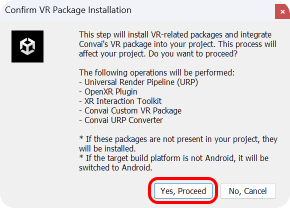
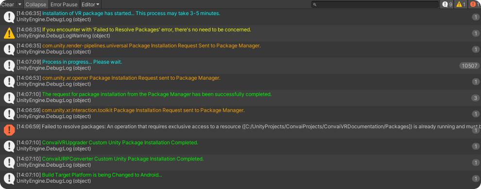
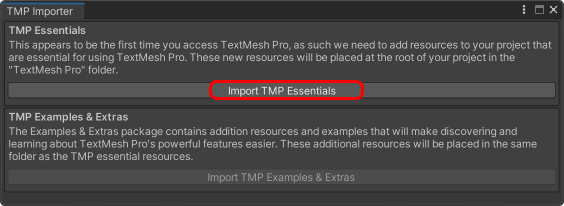
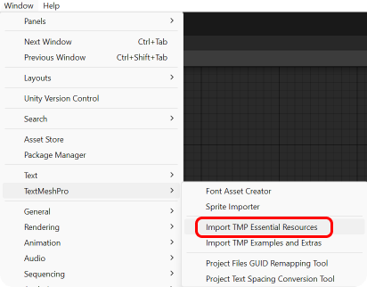
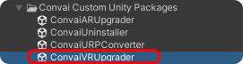
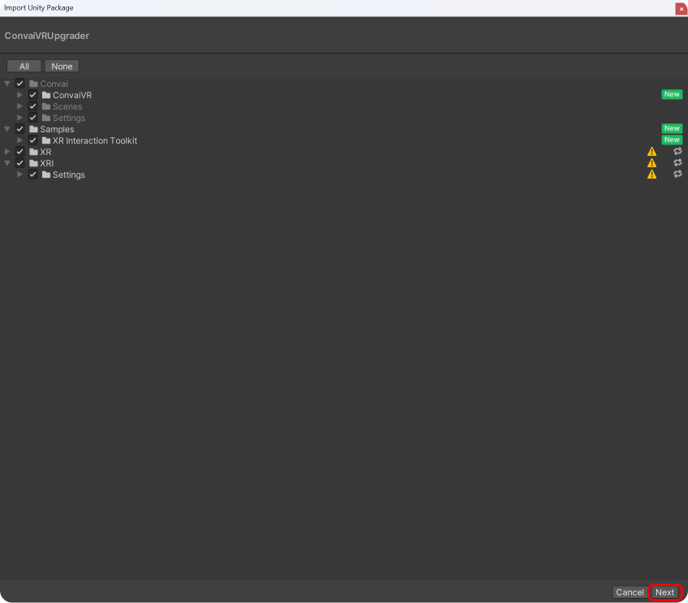
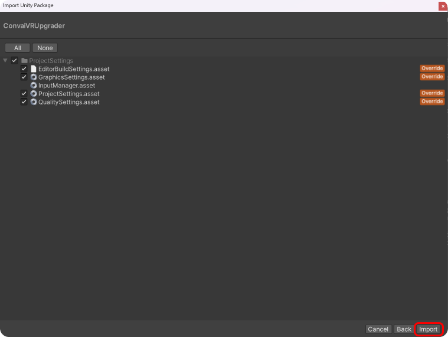
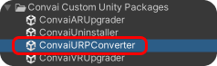
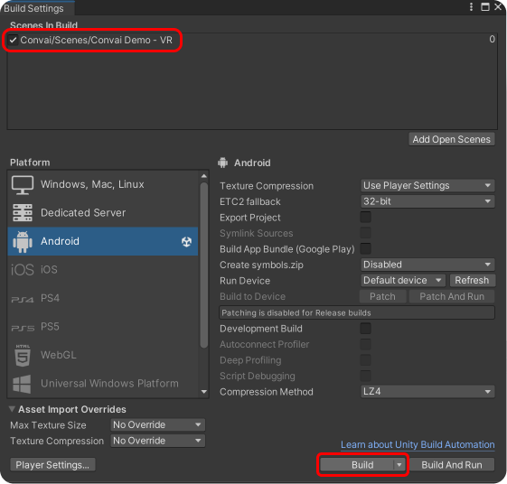
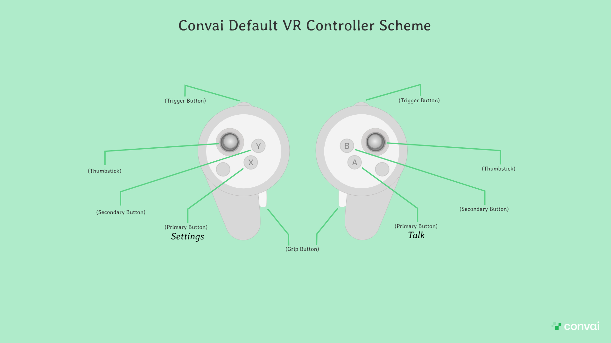

# Building for VR

## VR Installation

If you want to make your Convai Plugin compatible with VR, you can do so using the automatic or manual process. Please see the instructions below or check out our [_latest tutorial video_](https://www.youtube.com/watch?v=Q0TUT5vtEyg) on YouTube.


Unleash the Power of Convai AI NPCs in Your Unity VR Game


### Method 1 : Automatic Setup


Recommended for new projects.



The following processes will be performed:

* Universal Render Pipeline (URP)
* OpenXR Plugin
* XR Interaction Toolkit
* Convai Custom VR Package
* Convai URP Converter

**If these packages are not present, they will be installed.**



**If the target build platform is not Android, it will be switched to **_**Android.**_


1. Click on " _Convai / Convai Custom Package Installer / Install VR Package_ "

<figure><figcaption></figcaption></figure>

2. Confirm the changes and processes to be made. If you agree, the process will start.                     Click " **Yes, Proceed** " and the process will begin. You'll see logs in the console.

<figure><figcaption></figcaption></figure>

3. If you encounter an error like " Failed to Resolve Packages " don't worry. The process will continue and the error will be resolved automatically after the package installations are complete.

<figure><figcaption></figcaption></figure>

4. Open the " _Convai / Scenes / Convai Demo - VR_ " demo scene. If the TMP Importer window appears, click " **Import TMP Essentials** " to install TextMeshPro for UI text objects.

<figure><figcaption></figcaption></figure>

Alternatively, you can use the " _Window / TextMeshPro / Import TMP Essential Resources_ " to install it.

<figure><figcaption></figcaption></figure>

5. Build your project by going to " _File /Build Settings / Build_ " Ensure that the " **Convai Demo - VR** " scene is included in the Scenes in Build section.

Now everything is ready for testing. 🙂✅


Ensure you've set up your API Key. ( Convai / Convai Setup )


### Method 2 : Manual Setup&#x20;


Ensure you have the following packages installed in your project:

* OpenXR or Oculus XR
* XR Interaction Toolkit
* URP (Universal Render Pipeline)


1. Double-click on " _Convai / Convai Custom Unity Packages / ConvaiVRUpgrader.unitypackage_ "

<figure><figcaption></figcaption></figure>

2. You'll see a warning that the settings will overwrite your project settings. You can either allow it by clicking " **Import** " or create a temporary project by clicking " **Switch Project** "

<figure><figcaption></figcaption></figure>

3. In the Import Unity Package window, review the assets to be imported and click " **Next** "

<figure><figcaption></figcaption></figure>

4. In this window, select the project settings you want to import and complete the installation by clicking " **Import** ".

<figure><figcaption></figcaption></figure>

5. Open the " _Convai / Scenes/ Convai Demo - VR_ " demo scene. If the TMP Importer window appears, click " **Import TMP Essentials** " to install TextMeshPro for UI text objects.

<figure><figcaption></figcaption></figure>

6. If you see 3D objects in pink, it's a shader issue. If you're using URP, convert the materials to URP by double-clicking on " _Convai / Convai Custom Unity Packages / ConvaiURPConverter_ " and importing all assets in the window that appears.

<figure><figcaption></figcaption></figure>

7. Build your project by going to " _File / Build Settings / Build_ " Ensure that the " **Convai Demo - VR** " scene is included in the Scenes in **Build** section.

<figure><figcaption></figcaption></figure>

Now everything is ready for testing. 🙂✅


Ensure you've set up your API Key (Convai/Convai Setup).


### Convai Default VR Controller Scheme

<figure><figcaption></figcaption></figure>
