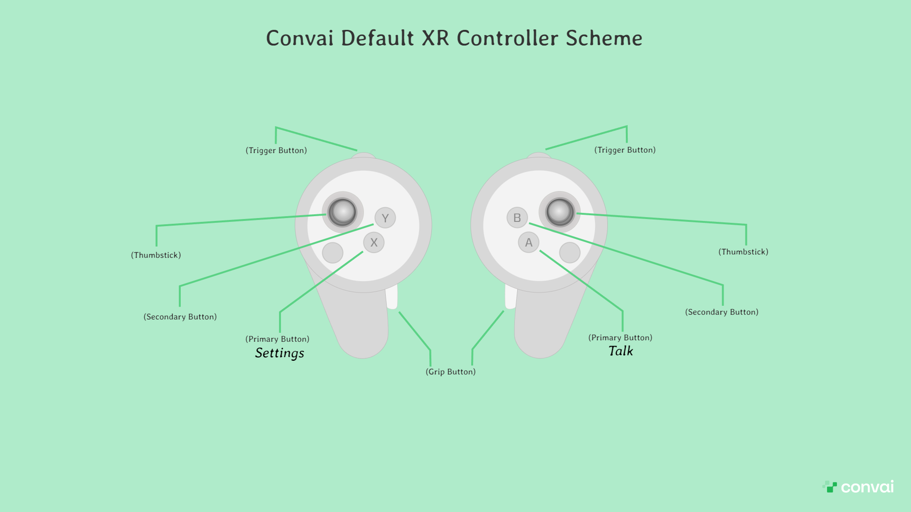

# Building for MR

## Integrating Convai with MR: Quick and Flexible Setup Options


Immersive AI Characters That Perceive & Engage in Mixed Reality Scenarios | Convai Unity Tutorial


Setting up Convai for Mixed Reality (MR) is easier than you might think. With just a few clicks, you can get Convai integrated directly into your MR projects.

To give users flexibility and customization options, we offer **two installation methods**:

* **Automatic Installation**
* **Manual Installation**

### **Automatic Installation**

The Automatic Installation method is ideal if you’re starting a new project and want to avoid dealing with MR packages or additional setup requirements. This method provides a fully Convai-integrated MR project right from the start, including the **Convai MR Demo Scene** for quick testing and exploration. This approach is particularly suitable for beginners.


**Note:** This installation method will modify Unity Project settings. These changes are necessary to ensure compatibility with Convai.


### **Manual Installation**

The Manual Installation method is designed for existing MR projects. With this method, you have full control over the setup, as **no project settings are modified, no demo scenes are added, and no customizations are applied**. Only Convai’s XR Unity Package will be integrated, giving you the freedom to use any MR SDKs without restrictions.

## Choose Your Installation Method

Select one of the two installation methods and click on the corresponding setup section below to follow the instructions.


[mr-automatic-installation.md](mr-automatic-installation.md)



[mr-manual-installation.md](mr-manual-installation.md)


## Convai Controller Scheme

<figure><figcaption></figcaption></figure>

