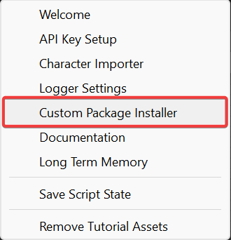
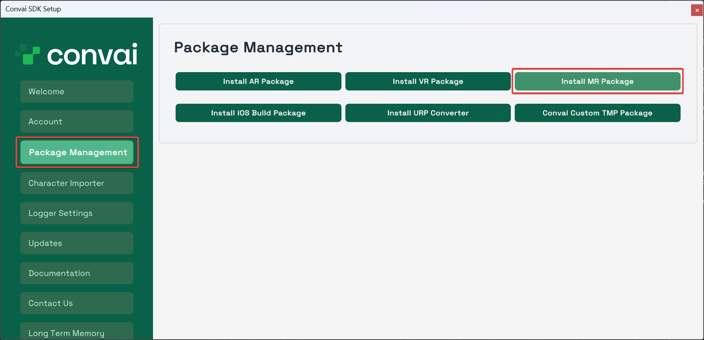
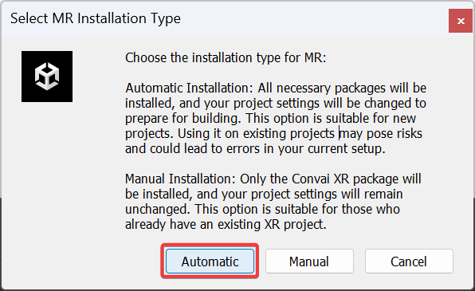
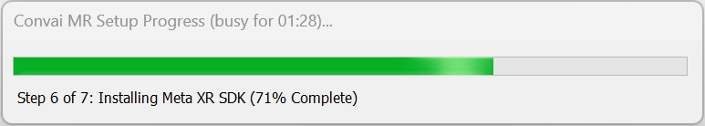
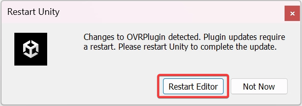
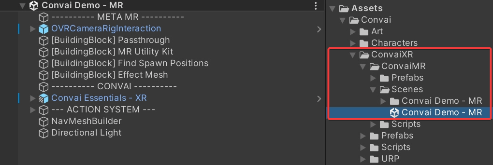
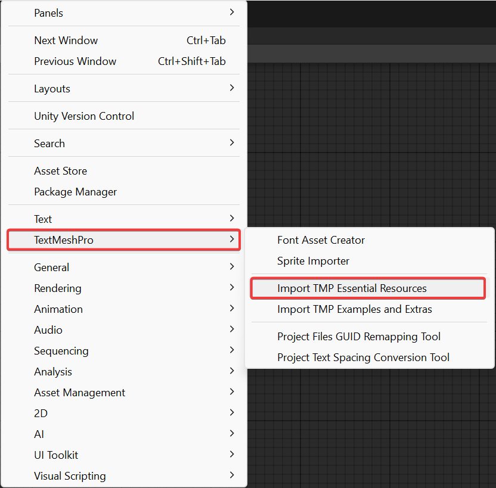
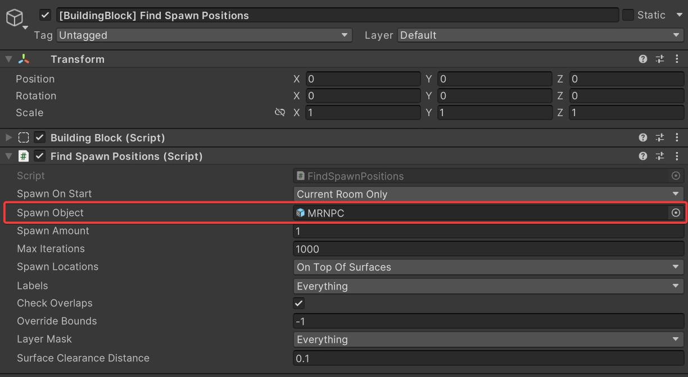

# MR Automatic Installation

## Automatic Installation Steps


The Automatic Installation method is ideal for users starting new projects who want a straightforward setup. It provides a fully integrated Convai MR project from the beginning, ensuring a smoother development experience.


### Step 1

In the top menu, click on **Convai**. Then, select **Custom Package Installer**.

<figure><figcaption></figcaption></figure>

### Step 2

In the Convai Panel that appears, click on **Package Management** and then select **Install MR Package**.

<figure><figcaption></figcaption></figure>

### Step 3

A new window will appear prompting you to select your installation type. For this documentation, we will proceed with **Automatic Installation**.

<figure><figcaption></figcaption></figure>

### Step 4

In the next window, carefully read the setup instructions, warnings, and details of the changes that will be applied.

### Step 5

When ready to proceed, click **Yes, proceed**.

<figure><figcaption></figcaption></figure>

### Step 6

The installation process will begin, taking approximately 5 minutes. The duration may vary depending on your computer's performance.

<figure><figcaption></figcaption></figure>

### Step 7

If a prompt titled **OVRPlugin Detected** from MetaSDK appears, click **Restart Editor** to continue.

<figure><figcaption></figcaption></figure>

### Step 8

Once the installation is complete, it’s time to open the demo scene.

* Navigate to **Assets > Convai > ConvaiXR > ConvaiMR > Scenes** and open **Convai Demo - MR**.

<figure><figcaption></figcaption></figure>

### Step 9

If you don’t have the **TextMeshPro** package installed, you’ll need it to display text properly in the demo scene. To install it:

* Go to **Window > TextMeshPro > Import TMP Essential Resources**.

<figure><figcaption></figcaption></figure>

* In the **Unity Package Import** window that appears, click **Import**.

<figure><figcaption></figcaption></figure>

### **Step 10**

Everything is now set up! :tada::sunglasses:&#x20;

You can build your project by going to **File > Build Settings**.

## Replacing the Spawned Character

### Step 1

In the demo scene, select **\[BuildingBlock] Find Spawn Positions** in the hierarchy.

### Step 2

In the **Spawn Object** field, drag and drop the character you imported into the project.

* If you’re unsure how to import your character, please refer to the relevant documentation [here](../../../unity-importing-ready-player-me-rpm-characters.md).

<figure><figcaption></figcaption></figure>


This demo scene uses **MetaSDK** by default. However, you are free to use other methods or SDKs to spawn your character, as there are no restrictions.

