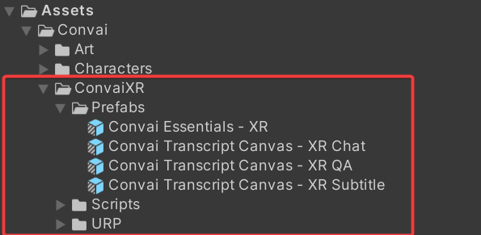

---
metaLinks:
  alternates:
    - >-
      https://app.gitbook.com/s/EtUJA212Zc1S9ACc8T4l/plugins-and-integrations/unity-plugin/building-for-supported-platforms/convai-xr/building-for-mr/mr-manual-installation
---

# MR Manual Installation

## Manual Installation Steps


This installation method is ideal for users working with existing projects who wish to customize their setup. It allows for compatibility with various other SDKs, enabling you to integrate Convai seamlessly into your current workflows without limitations on using third-party SDKs.


### Step 1

In the top menu, click on **Convai**. Then, select **Custom Package Installer**.

<figure><figcaption></figcaption></figure>

### Step 2

In the Convai Panel that appears, click on **Package Management** and then select **Install MR Package**.

<figure><figcaption></figcaption></figure>

### Step 3

A new window will appear prompting you to select your installation type. For this documentation, we will proceed with **Manual Installation**.

<figure><figcaption></figcaption></figure>

### Step 4

The installation will start. This process will be completed quickly as only the ConvaiXR Package will be installed.

<figure><figcaption></figcaption></figure>

### Step 5

Once installation is complete, the **Convai Essentials - XR Prefab** will be added to your scene.&#x20;

This is the only GameObject required for Convai to run in your scene.

<figure><figcaption></figcaption></figure>

### Step 6

The imported files can be found under **Assets > Convai > ConvaiXR**.

<figure><figcaption></figcaption></figure>

### Step 7

The final step is to import your character into the scene.&#x20;

If you need guidance on this, please refer to the relevant documentation [here](../../../unity-importing-ready-player-me-rpm-characters.md).

Everything is now set up! :tada::sunglasses:&#x20;


To activate Convai in your scene, simply add the **Convai Essentials - XR Prefab**.&#x20;

There are no limitations on Third-Party SDKs, so you are free to use Convai with any XR SDK of your choice.



Please follow [this](../interacting-with-xr-ui-elements.md) documentation to interact with Convai's Settings Panel.

