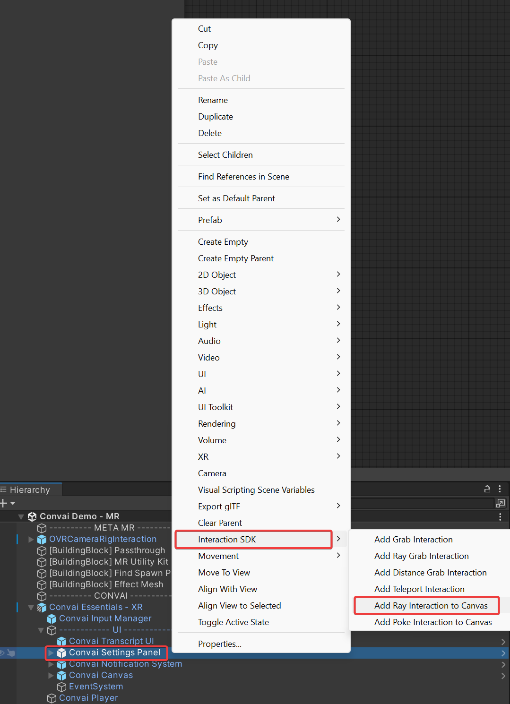
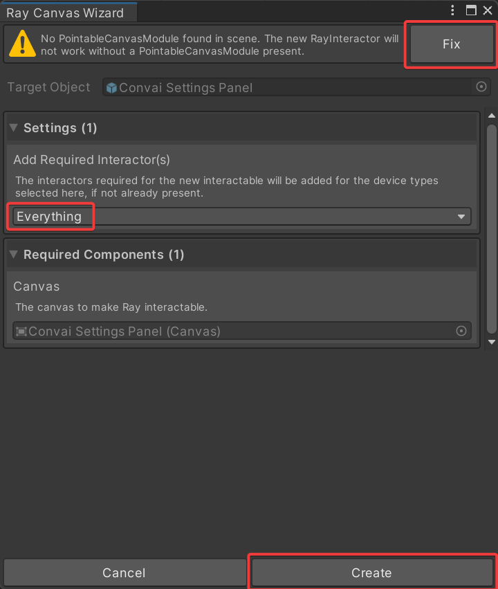
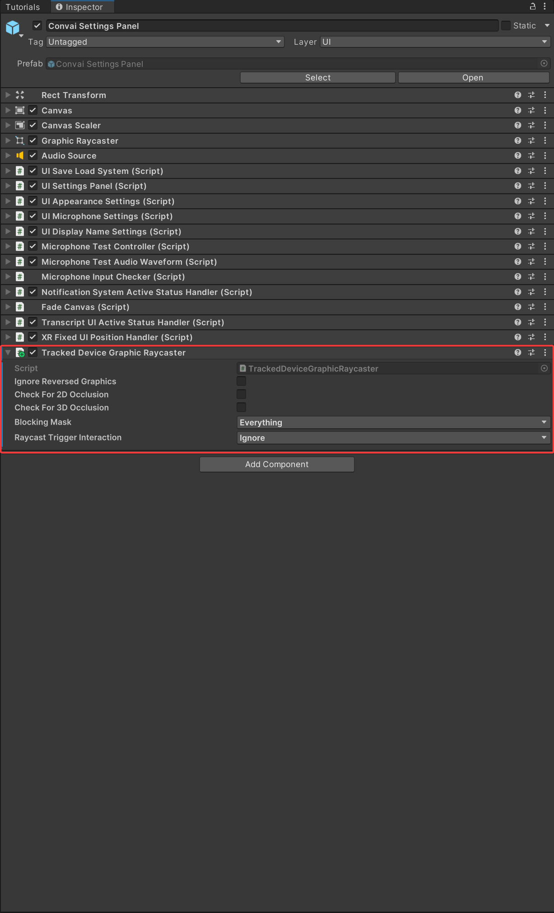

# Interacting with XR UI Elements

Interacting with the UI may vary depending on the SDK you are using. For popular frameworks like **XR Interaction Toolkit** and **Meta SDK**, you can follow the documentation below. We recommend checking the relevant documentation for other SDKs.

To make the **Settings Panel** interactable in XR environments, where you can test your microphone at runtime or change the appearance of the Chat UI in Convai, follow these steps:

## Meta SDK

### Step 1

Right-click on the **Convai Settings Panel**.

### Step 2

Select **Interaction SDK** and then click on **Add Ray Interaction to Canvas**.

<figure><figcaption></figcaption></figure>

### Step 3

If a warning appears in the new window, click the **Fix** button.

### Step 4

In the **Settings** section, choose **Everything**. Then click **Create**.

<figure><figcaption></figcaption></figure>

### Step 5

To prevent the **ISDK\_RayInteraction** from running while the **Settings Panel** is closed, drag it onto the **Panel** GameObject.

<figure><figcaption></figcaption></figure>

## XR Interaction Toolkit

### Step 1

Click on the **Convai Settings Panel**.

### Step 2

In the **Inspector**, click the **Add Component** button.

Add the **Tracked Device Graphic Raycaster** component.

<figure><figcaption></figcaption></figure>
