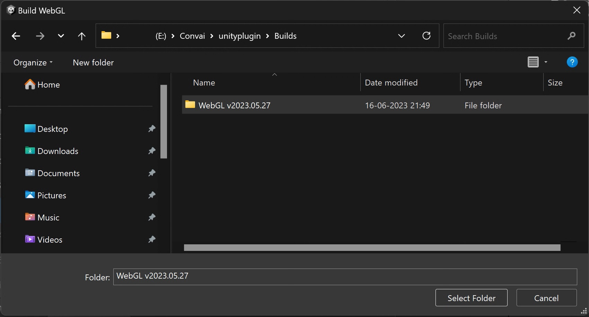

# Building for WebGL

Our Unity Asset Store, Core, Complete, and Action versions of the plugins can only build standalone applications.&#x20;


[**Download the WebGL version of the Unity Plugin here.**](https://drive.google.com/file/d/1pFiogPV41rOqWdDkCY82qcqrAlbo-Z3N/view?usp=sharing)



[**Download a Complete Demo with Multiple Characters here.**](https://drive.google.com/file/d/1NnkPZflOpSNYRrfFyV01chkoEMNj5YTp/view?usp=sharing)



[**Try out the Demo on itch.io here.**](https://convai.itch.io/webgl-demo)



Please ensure that Git is installed on your computer prior to proceeding.\
[**Download Git from here.**](https://git-scm.com/downloads)


Follow the Import and Setup Instructions from [import-and-setup.md](import-and-setup.md "mention") and [setting-up-unity-plugin.md](setting-up-unity-plugin.md "mention").&#x20;

If you face an error with missing Ready Player Me, add these lines to your manifest.json file in `<Project Folder>/Packages` folder.

```json
"com.atteneder.gltfast": "https://github.com/atteneder/glTFast.git#v5.0.0",
"com.readyplayerme.avatarloader": "https://github.com/readyplayerme/rpm-unity-sdk-avatar-loader.git#v1.3.3",
"com.readyplayerme.core": "https://github.com/readyplayerme/rpm-unity-sdk-core.git#v1.3.2",
"com.readyplayerme.webview": "https://github.com/readyplayerme/rpm-unity-sdk-webview.git#v1.2.0",
```


Updating Ready Player Me packages (Core, WebView and AvatarLoader) to the latest version causes a persistent error: `The type or namespace name 'GLTFDeferAgent' could not be found` \
\
If prompted to update, please do not update Ready Player Me packages. Just click cancel. Last successfully tested version for Ready Player Me is as follows: \
Core: `v1.3.2` \
WebView: `v1.2.0` \
AvatarLoader: `v1.3.3` \
\
If you have already upgraded, you can add these line to replace the corresponding existing lines to the `<project folder>/Packages/manifest.json` to revert the Ready Player Me packages to last stable version: `"com.readyplayerme.avatarloader": "https://github.com/readyplayerme/rpm-unity-sdk-avatar-loader.git#v1.3.3",`\
&#x20;`"com.readyplayerme.core": "https://github.com/readyplayerme/rpm-unity-sdk-core.git#v1.3.2",`\
&#x20;`"com.readyplayerme.webview": "https://github.com/readyplayerme/rpm-unity-sdk-webview.git#v1.2.0",`


When you are about to play the scene in the editor, you will notice that you are facing this error when you get in the range of the character.


```
EntryPointNotFoundException: initializeConvaiClient assembly:<unknown assembly> type:<unknown type> member:(null)
ConvaiGRPCWebAPI.OnTriggerEnter (UnityEngine.Collider other) (at Assets/Convai/Scripts/Utils/ConvaiGRPCWebAPI.cs:80)
```


This is because we cannot test WebGL directly from the Unity Editor. We will have to create a development build to test out WebGL.

Before we do that, we will move the WebGL Templates folder out of the Convai folder and place it inside the Assets folder.&#x20;

<figure><figcaption></figcaption></figure>

<figure><figcaption></figcaption></figure>

This will allow Unity to recognize the custom WebGL Template.

Open the Project Settings > Player Settings and head over to the WebGL settings. Under the Resolution and Presentation tab, select the Convai Template or the Convai PWA Template.

<figure><figcaption></figcaption></figure>

Then open the Build Settings, and switch your build platform to WebGL.

<figure><figcaption></figcaption></figure>

Check the development build field and then click on Build and Run.

<figure><figcaption></figcaption></figure>

Select the Folder where you want the build to be.

<figure><figcaption></figcaption></figure>

A WebPage with the WebGL version of the game will open up. Allow the microphone, and you are good to go!

<figure><figcaption></figcaption></figure>


For subsequent Build and Runs, use the Unity shortcut key Ctrl + B.



When you are ready with your production build, just uncheck the Development Build field in the Build Settings and you are set!


