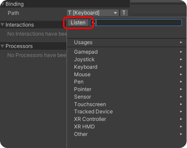
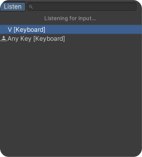

# Input Management


Make sure that **Active Input Handling** in&#x20;

"_Project Settings > Player_" is set to **Both** or **Input System Package (New)**.&#x20;

Our recommendation is Both. This way, you can use both the new and old input systems. Using the old input system can be faster when creating inputs for testing purposes.


<figure><figcaption></figcaption></figure>

## How to Change the Talk Button or Any Input?

1.  Double click on the "**Controls**" asset in your project tab. \

    <figure><figcaption></figcaption></figure>
2. You can setup multiple control schemes for different devices here, currently we have it for PC (Keyboard & Mouse) and Gamepad. For mobile, we have provided joystick and buttons, which are mapped to Gamepad controls for functionality, but you can directly add touchscreen and use its different features to trigger an Input Action. You can also add your own control scheme if you want support for a different device by clicking on "Add Control Scheme".&#x20;

<figure><figcaption></figcaption></figure>

3.  Find the Input Action you want to change in the above window. If you want to add a new Input Action, refer to the other section in documentation. In this case, we selected "**Talk Key Action**" to change the talk button. Click on "**T \[Keyboard]**". In the Binding Properties window, click on the " **T \[Keyboard]** " button in the Path field.\

    <figure><figcaption></figcaption></figure>

4. Press the " **Listen** " button in the top left of the opened window. If you prefer, you can choose your desired input from the categories below.

<figure><figcaption></figcaption></figure>

6. Press the key you want to assign and it will be reflected in the control asset.

<figure><figcaption></figcaption></figure>

## How to Add a New Input Action?

1.  First, go to the controls asset mentioned above and use the add button to create an input action. For this example, we will call it interact and provide it the binding with \[E] button.\

    <figure><figcaption></figcaption></figure>

2.  Then, click on the \<No Binding> item to setup binding for this action. As before, you can use the listen button (has a UI bug for Windows but works) or you can select the key from dropdown. After selecting the binding (we will select \[E] key for this), don't forget to press on the Save Asset option on the top menu. \

    <figure><figcaption></figcaption></figure>
3.  You will now get an error saying ConvaiInputManager does not implement OnInteract. We need to implement this. Open the " **ConvaiInputManager.cs** " script to do so.                                                                                           ( " _Convai / Scripts / Runtime / Core / ConvaiInputManager.cs_ " )

    <figure><figcaption></figcaption></figure>
4.  Your IDE might suggest you to implement missing members. If it doesn't we can manually write the OnInteract function like in the last figure shown. You receive a callback context which shows which frame input started, performed or got cancelled which you can use for different purposes. And that's it the error should be gone and you are good to go!\

    <figure><figcaption></figcaption></figure>

    <figure><figcaption></figcaption></figure>
