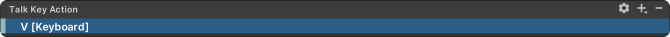

# Input Management


Make sure that **Active Input Handling** in&#x20;

"_Project Settings > Player_" is set to **Both** or **Input System Package (New)**.&#x20;

Our recommendation is Both. This way, you can use both the new and old input systems. Using the old input system can be faster when creating inputs for testing purposes.


<figure><figcaption></figcaption></figure>

## How to Change the Talk Button or Any Input?

1.  Double click on the "**Controls**" asset in your project tab. \


    <figure><figcaption></figcaption></figure>
2. You can setup multiple control schemes for different devices here, currently we have it for PC (Keyboard & Mouse) and Gamepad. For mobile, we have provided joystick and buttons, which are mapped to Gamepad controls for functionality, but you can directly add touchscreen and use its different features to trigger an Input Action. You can also add your own control scheme if you want support for a different device by clicking on "Add Control Scheme".&#x20;

<figure><figcaption></figcaption></figure>

3.  Find the Input Action you want to change in the above window. If you want to add a new Input Action, refer to the other section in documentation. In this case, we selected "**Talk Key Action**" to change the talk button. Click on "**T \[Keyboard]**". In the Binding Properties window, click on the " **T \[Keyboard]** " button in the Path field.\


    <figure><figcaption></figcaption></figure>


4. Press the " **Listen** " button in the top left of the opened window. If you prefer, you can choose your desired input from the categories below.

<figure><figcaption></figcaption></figure>

6. Press the key you want to assign.

<figure><figcaption></figcaption></figure>

7. After assigning the desired key, you can see in the Inspector that the input for " **Talk Key Action** " has changed.

<figure><figcaption></figcaption></figure>

## How to Add a New Input Action?

1. First, open the " **ConvaiInputManager.cs** " script.                                                                                           ( " _Convai / Scripts / Utils / ConvaiInputManager.cs_ " )
2. Create a variable of type **InputAction** in the field where other InputAction variables are located. We'll create an Interaction Key Action for example.

```csharp
public InputAction InteractionKeyAction;
```

<figure><figcaption></figcaption></figure>

3. In the OnEnable method, you need to enable the InputAction you created.

```csharp
InteractionKeyAction.Enable();
```

<figure><figcaption></figcaption></figure>

4. Now, let's create a method to access this InputAction.

```csharp
public bool WasInteractionKeyPressed()
{
#if ENABLE_INPUT_SYSTEM
    return InteractionKeyAction.WasPressedThisFrame();
#else
    return Input.GetKeyDown(KeyCode.E);
#endif
}
```

The **#if ENABLE\_INPUT\_SYSTEM** preprocessor directive ensures that this #if statement will function correctly when you select either **' Both '** or ' **Input System Package (New)** ' in " _Project Settings > Player > Active Input Handling_ "

If you select " **Input Manager (Old)** " for Active Input Handling, the **#else** statement will work. Thus, in the **#else** section, we added the equivalent for the old input system.

<figure><figcaption></figcaption></figure>

5. After applying the above steps, save by pressing " **CTRL+S** " Make sure you've done everything correctly.
6. Return to Unity, click on ConvaiInputManager and in the Inspector, you can see the added Input Action. To assign a key to this Input Action, click the " **+** " button.

<figure><figcaption></figcaption></figure>

7. In the opened window, click on the " **Add Binding** " button.

<figure><figcaption></figcaption></figure>

8. Click the " **Listen** " button in the opened window and press the key you want to assign or choose the desired key from the categories.

<figure><figcaption></figcaption></figure>

9. After selecting the desired key, you can see the assigned key under your Input Action in the Inspector.

<figure><figcaption></figcaption></figure>
