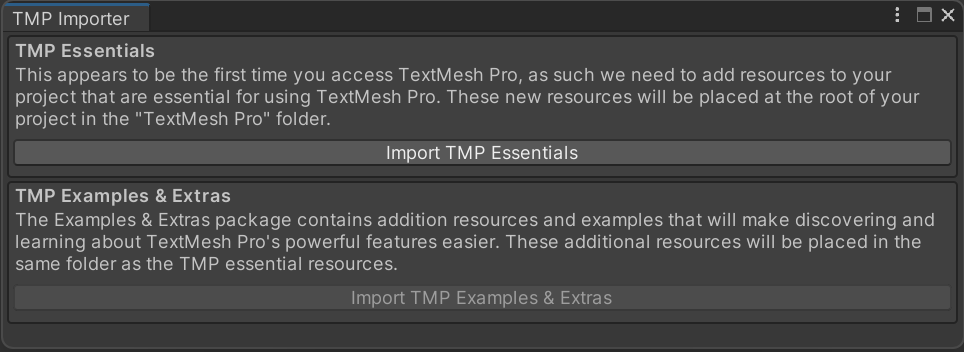
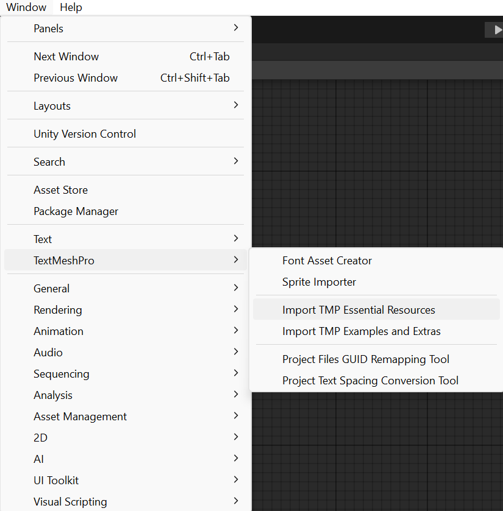
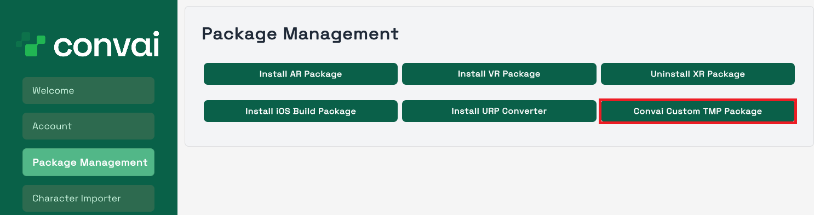

---
metaLinks:
  alternates:
    - >-
      https://app.gitbook.com/s/EtUJA212Zc1S9ACc8T4l/plugins-and-integrations/unity-plugin/utilities/language-support
---

# Language Support

Convai offers comprehensive transcript and voice support for a wide range of languages. To facilitate seamless integration, our Unity plugin comes with a custom TextMeshPro (TMP) package, which includes essential fonts and required settings for major languages.


This requires TMP Essentials pre-installed, which can be done through the TextMeshPro option in the Window tab or through a prompt on starting the project.&#x20;


<figure><figcaption>
TMP Importer (will appear automatically if TMP Essentials are not imported)
</figcaption></figure>

<figure><figcaption>
TMP Essentials Manual Import Process
</figcaption></figure>

## Setup

To implement these language-specific features in your project:

1. Navigate to the Convai Setup Window within Unity.
2. Locate the Package Management section.
3. Click on the "Convai Custom TMP Package" button.

<figure><figcaption></figcaption></figure>

Once installed, just import the character for which you require the language support, talk with it and the font will automatically render in the transcript.

For now, we provide fonts for these languages:

* Arabic
* Japanese
* Korean
* Chinese

## RTL Support

We also provide support for Right-to-Left languages, like Urdu, Persian and Arabic through our Chat UIs.  So, for example, if you talk with an Arabic character or if the character's name is in Arabic, the text will automatically enable the RTL feature provided by unity to reflect proper transcripts.

<figure><figcaption></figcaption></figure>
