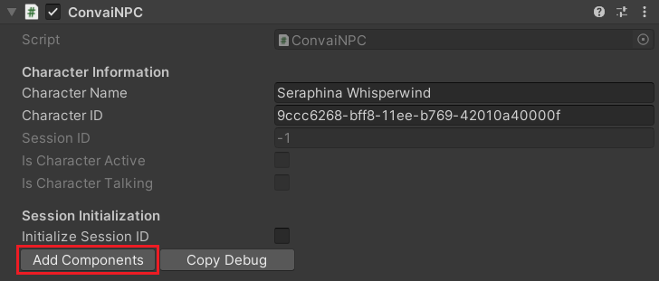

# Long Term Memory

Long-Term Memory (LTM) enables the persistent storage of conversational history with NPCs, allowing players to seamlessly continue interactions from where they previously left off, even across multiple sessions. This feature significantly enhances the realism of NPCs, aligning with our goal of creating more immersive and lifelike characters within your game.


Prerequisite: Have a project with Convai SDK version 3.1.0 or higher. If you don't have it, check this documentation&#x20;

[setting-up-unity-plugin.md](../setting-up-unity-plugin.md "mention")


### Steps to get LTM working

1.  Select your Convai Character&#x20;

    <figure><figcaption></figcaption></figure>
2.  Add the Long-Term Memory Component onto your character

    <figure><figcaption></figcaption></figure>
3.  Make sure that Long Term Memory is enabled for that character&#x20;

    <figure><figcaption></figcaption></figure>

Long Term Memory should now be working for your character.

### Components of the LTM System

#### Convai Long Term Memory Component

This component will enable or disable LTM right from the unity editor

<figure><figcaption></figcaption></figure>

Toggling Long Term Memory

1\) Click the button provided in the component

<figure><figcaption></figcaption></figure>

2\) It will take some time to update, and after that the new status of the LTM should be visible in the inspector.

<figure><figcaption></figcaption></figure>


Since enabling or disabling Long-Term Memory (LTM) for a character is a global action that impacts all players interacting with that character, we strongly recommend against toggling the LTM status at runtime. This functionality should be managed exclusively by developers or designers through the editor to ensure consistent gameplay experiences.


### Troubleshooting


Grpc.Core.RpcException: Status(StatusCode=InvalidArgument, Detail="Cannot find speaker with id: 99fbef96-5ecb-11ef-93ce-42010a7be011.")


If you encounter this error, ensure that the **SpeakerID** was created using the same API key currently in use. If you're uncertain about the API key used, you can reset the **SpeakerID** and **PlayerName** by accessing the `ConvaiPlayerDataSO` file located in `Assets > Convai > Resources`, allowing you to start the process anew.

### Management of Speaker ID(s)

It is essential for developers to efficiently manage the Speaker ID(s) generated using their API key, as the number of IDs that can be created is limited and dependent on the subscription tier. Proper management ensures optimal usage of resources and prevents potential disruptions in the application's functionality.

#### Speaker ID limit per API key are as follows

| Tier                         | Limit                   |
| ---------------------------- | ----------------------- |
| Personal                     | 1                       |
| Gamer / Indie / Professional | 5                       |
| Partner / Enterprise         | 100 (Can be Customized) |

You can view all the Speaker ID(s) associated with a specific API key by accessing the **Convai Window** within your Unity project. This feature provides a comprehensive list of IDs, allowing for easier management and monitoring.


Ensure that the API key is correctly entered; otherwise, the feature will not function as expected. Accurate API key input is critical for accessing and managing Speaker ID(s) through the Convai Window in Unity.


<figure><figcaption></figcaption></figure>

Head over to Long Term Memory Section

<figure><figcaption></figcaption></figure>

If the message "No Speaker ID(s) Found" appears, there is no need to proceed with this guide. However, if a Speaker ID list is displayed, it's advisable to delete any ID(s) that are no longer in use or needed to optimize your available resources.

<figure><figcaption></figcaption></figure>
