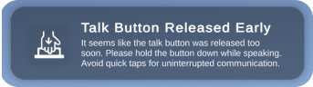
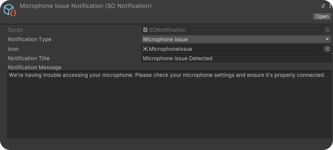

# Notification System

The Convai plugin comes with default notifications, totaling four. Here they are:


## Notifications

### Not Close Enough to the Character

Appears when you press the talk button but there is no active NPC nearby.

<figure><figcaption></figcaption></figure>

### Talk Button Released Early

Appears if you release the talk button in less than 0.5 seconds.

<figure><figcaption></figcaption></figure>

### Microphone Issue Detected

Appears when the recorded audio input level is below the threshold.

<figure><figcaption></figcaption></figure>

### Connection Problem

Appears when there is no internet connection upon launching the application.

<div align="center" data-full-width="true">

<figure><figcaption></figcaption></figure>

</div>


## How to Add Your Own Notification?

Adding your custom notification is straightforward.&#x20;

Let's go through the steps to add a " **CharacterStartedListening**" notification as an example.

1. Open the script _"Convai/Scripts/Notification System/Notification Type.cs."_  This script stores Notification Types as enums. Give a name to your desired Notification type and add it here.

<figure><figcaption></figcaption></figure>

2. Right-click on _"Convai / Scripts / Notification System / Scriptable Objects"_ and select _"Create > Convai > Notification System > Notification"_ then create a "**Notification Scriptable Object".**

<figure><figcaption></figcaption></figure>

3. Name the created Notification Scriptable Object. Click on it, and fill in the fields in the Inspector as desired.

<figure><figcaption></figcaption></figure>

4. Add the created Notification Scriptable Object to _"Convai/Scripts/Notification System/Scriptable Objects"_ under **"Convai Default Notification Group"** (details of Notification Group here\*\*\*\*).

<figure><figcaption></figcaption></figure>

5. Your Notification is now ready. The last step is to call this Notification from where you need it. For example, if you created the " **CharacterStartedTalking** " Notification, find the location where your character listens and write the code.

<figure><figcaption></figcaption></figure>


```csharp
NotificationSystemHandler.Instance.NotificationRequest(NotificationType.CharacterStartedListening);
```


6. Replace the parameter with the NotificationType you created.                                                                    (For our example, _**NotificationType.CharacterStartedListening**_)
7. Ensure that the Convai Notification System is present in your scene.                                                        (accessible from "_Convai/Prefabs/ Notification System_")

All steps are complete, and you're ready to test!🙂✅

## Notification Scriptable Object

This Scriptable Object stores information about a Notification

* Notification Type
* Notification Icon
* Notification Title
* Notification Message

To create a new Notification Scriptable Object, right-click anywhere in the Project Window and select "_Create > Convai > Notification System > Notification_"

<figure><figcaption></figcaption></figure>

## Notification Group Scriptable Object

This Scriptable Object stores Notification Scriptable Objects as groups. When a Notification is requested, it searches for the Notification using the specified Notification Group in the Convai Notification System prefab's Notification System Handler script.&#x20;

You can create different Notification groups based on your needs. Note: If your referenced Notification Group does not have the Notification you want, that Notification won't be called.

&#x20;The Convai Default Notification Group has four Notifications, but you can add more or create a new group with additional notifications.

##

<figure><figcaption></figcaption></figure>
