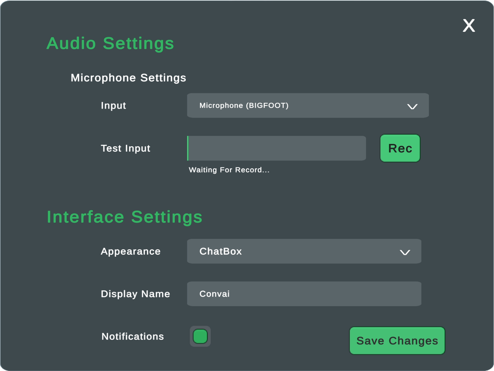
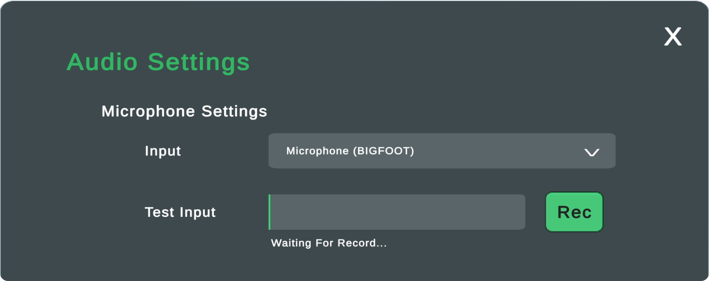
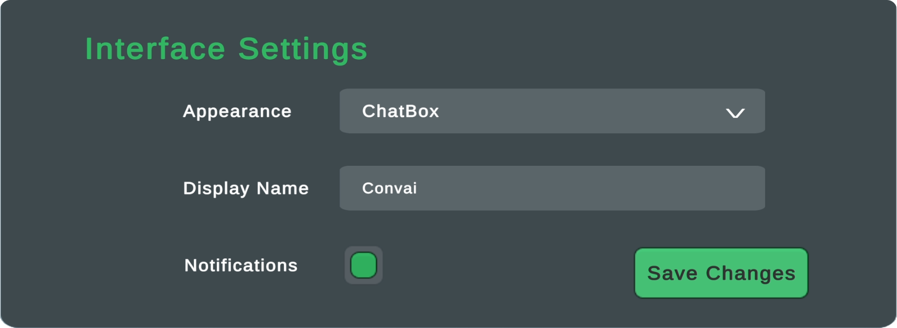
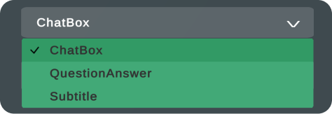

# Settings Panel

<figure><figcaption>
On the PC platform, you can open the Settings Panel by pressing F10.                                                                                                                        For mobile platforms, you need to press the Settings button in the UI designs.
</figcaption></figure>

Settings Panel consists of two main sections.

* Audio Settings
* Interface Settings

### Audio Settings

<figure><figcaption></figcaption></figure>

#### **Microphone Settings**

The Microphone Settings section is primarily for troubleshooting and testing the microphone when using the Convai plugin.

* In the Input section, you can view the microphones connected to your computer and select the desired one.
* In the Test Input field, you can record your voice using the selected microphone in the Input section. After clicking Stop, you can listen to the recorded voice and observe the sound levels.

### Interface Settings

<figure><figcaption></figcaption></figure>

#### Appearance

The first setting that greets us here is the Appearance setting.&#x20;

In the Appearance section, you can switch between Transcript UI designs.&#x20;

There are three Transcript UI options:&#x20;

* ChatBox&#x20;
* QuestionAnswer
* Subtitle

<figure><figcaption>
Upon selecting a UI from the dropdown menu, you can preview it briefly.
</figcaption></figure>

#### Display Name

The second section in Interface Settings is the Display Name section. This section allows you to change how the user's name appears in the Transcript UI.

#### Notifications Checkmark

The last section in Interface Settings is the Notifications Checkmark.&#x20;

Convai sometimes displays notifications on the screen to inform the user. If you want to disable these notifications, you can click the checkbox here. ( If the box is green, it's active. If empty, it's inactive )&#x20;

For more information about notifications, you can refer to this [link](notification-system.md).
