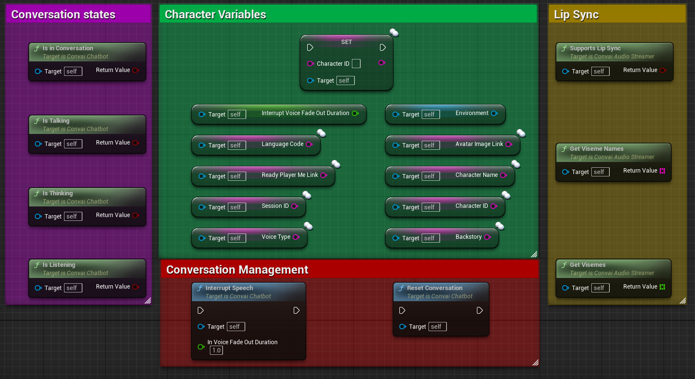

# Convai Chatbot

**Convai Chatbot** is an Actor component responsible for processing and getting a response for the voice audio coming from the [**Convai Player**](convai-player.md) component. It plays the audio response and has a variety of useful events for transcription, actions, text response, and others.

## Properties and Functions

<figure><figcaption>
Convai Chatbot properties and functions
</figcaption></figure>

### Character Variables

| Property                          | Type               | Description                                                                                                                                                                                                                                           |
| --------------------------------- | ------------------ | ----------------------------------------------------------------------------------------------------------------------------------------------------------------------------------------------------------------------------------------------------- |
| Character Id                      | FString            | The character ID you would like to assign to the component.                                                                                                                                                                                           |
| Interrupt Voice Fade Out Duration | Float              | Time in seconds to gradually fade out voice response when interrupted until it is stopped.                                                                                                                                                            |
| Language Code                     | FString            | Read the value of Language Code.                                                                                                                                                                                                                      |
| Ready Player Me Link              | FString            | Read the value of Ready Player Me Link.                                                                                                                                                                                                               |
| Session Id                        | FString            | To track memory of a previous conversation, set to -1 means no previous conversation, (this property will change as you talk to the character) you can save the session ID for a conversation and then set it back later on to resume a conversation. |
| Voice Type                        | FString            | Read the value of the Variable VoiceType.                                                                                                                                                                                                             |
| Environment                       | UConvaiEnvironment | Contains all relevant objects and characters in the scene including the (Player), and also all the actions doable by the character.                                                                                                                   |
| Avatar Image Link                 | FString            | Read the value of Avatoar Image Link.                                                                                                                                                                                                                 |
| Character Name                    | FString            | Read the value of variable CharacterName.                                                                                                                                                                                                             |
| Backstory                         | FString            | Read the value of variable Backstory.                                                                                                                                                                                                                 |

### Conversation States

| Function               | Returns   | Description                                                                                         |
| ---------------------- | --------- | --------------------------------------------------------------------------------------------------- |
| `Is in Conversation()` | `Boolean` | Returns **True,** if the character is talked to, is talking, or is processing the response.         |
| `Is Talking( )`        | `Boolean` | Returns **True,** if the character is currently talking.                                            |
| `Is Thinking()`        | `Boolean` | Returns **True,** if the character is still processing and has not received the full response yet.  |
| `Is Listening ()`      | `Boolean` | Returns **True,** if the character is currently listening to the player.                            |

### Lip Sync

| Function              | Returns            | Description                                                                       |
| --------------------- | ------------------ | --------------------------------------------------------------------------------- |
| `Supports Lip Sync()` | `Boolean`          | Returns `True`, if LipSync component is available and attached to the character.  |
| `Get Viseme Names()`  | `Array of Strings` | Returns list of viseme names.                                                     |
| `Get Visemes()`       | `Array of Float`   | Returns last predicted viseme scores.                                             |

## Conversation Management

| Function               | Returns | Description                                                                                                                       |
| ---------------------- | ------- | --------------------------------------------------------------------------------------------------------------------------------- |
| `Interrupt Speech()`   | `Void`  | Interrupts the current speech with a provided fade out duration.                                                                  |
| `Reset Conversation()` | `Void`  | Reset the conversation with the character and remove previous memory. This is the same as setting the session ID property to -1.  |

### Events

<figure><figcaption>
<strong>Convai Chatbot</strong> component events schematic
</figcaption></figure>

### Event Names and Description.&#x20;

<table><thead><tr><th width="262">Event Name</th><th>Description</th></tr></thead><tbody><tr><td>On Actions Received</td><td>Called when new actions are received from the character.</td></tr><tr><td>On Text Received</td><td>Called when new text is received from the character.</td></tr><tr><td>On Transcription Received</td><td>Called when new transcription is available.</td></tr><tr><td>On Started Talking</td><td>Called when the character starts talking.</td></tr><tr><td>On Finished Talking</td><td>Called when the character stops talking.</td></tr><tr><td>On Failure</td><td>Called when there is an error.</td></tr></tbody></table>

### Event Parameters

<table><thead><tr><th width="260">Parameter</th><th>Description</th></tr></thead><tbody><tr><td>Bot Text</td><td>The received text</td></tr><tr><td>Audio Duration</td><td>Duration of spoken received text. Is equal to zero if only text was received and no audio.</td></tr><tr><td>Is Final</td><td>True if this is the last chunk of text/transcription to be received.</td></tr><tr><td>Transcription</td><td>The transcription received.</td></tr><tr><td>Is Transcription Ready</td><td>True if the received transcription is ready and is not going to change anymore, false if the transcription is still in an intermediate state and is going to change.</td></tr></tbody></table>
