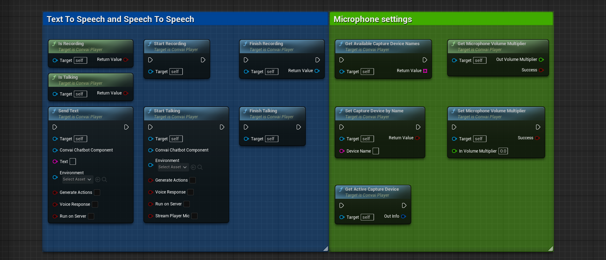

# Convai Player

**Convai Player** is an Actor component responsible for capturing microphone audio and streaming it to a Convai character.&#x20;


For voice chat to work in multiplayer, this component must be added to the player's possessed object and not the PlayerController.


<figure><figcaption>
Convai Player functions
</figcaption></figure>

### Text to Speech and Speech To Speech

<table><thead><tr><th width="328.3333333333333">Functions</th><th>Returns</th><th>Description</th></tr></thead><tbody><tr><td><code>Is Recording()</code></td><td><code>Boolean</code></td><td>Returns <code>True</code> if microphone audio is recorded, <code>False</code> otherwise. </td></tr><tr><td><code>Is Talking()</code></td><td><code>Boolean</code></td><td>Returns True is microphone audio is been streamed, false otherwise. </td></tr><tr><td><code>Start Recording()</code></td><td><code>Void</code></td><td>Start recording audio from microphone, use "Finish Recording" function afterwards. </td></tr><tr><td><code>Finish Recording()</code></td><td><code>USoundWave*</code></td><td>Stops recording from the microphone and outputs the recorded audio from microphone. </td></tr><tr><td>
<code>Send Text(</code>

<code>UConvaiChatbotComponent* ConvaiChatbotComponent,</code> 

<code>FString Text,</code> 

<code>UConvaiEnvironment* Environment, bool GenerateActions,</code> 

<code>bool VoiceResponse,</code> 

<code>bool RunOnServer,</code> 

<code>bool UseServerAPI_Key</code>

<code>)</code>
</td><td><code>Void</code> </td><td>Sends text to character. </td></tr><tr><td>
<code>Start Talking(</code>

<code>UConvaiChatbotComponent* ConvaiChatbotComponent, UConvaiEnvironment* Environment, bool GenerateActions,</code> 

<code>bool VoiceResponse,</code> 

<code>bool RunOnServer,</code> 

<code>bool StreamPlayerMic,</code> 

<code>bool UseServerAPI_Key</code>

<code>)</code>
</td><td><code>Void</code></td><td>Starts streaming microphone audio to the character. Use "Finish Talking" afterwards to let the character know that you are doing talking. </td></tr><tr><td><code>Finish Talking()</code></td><td><code>Void</code></td><td>Stops streaming microphone audio to the character. </td></tr></tbody></table>

### Microphone Settings

| Functions                              | Returns            | Description                                |
| -------------------------------------- | ------------------ | ------------------------------------------ |
| `Get Available Capture Device Names()` | `TArray<FString>`  | Returns all the available capture devices. |
| `Get Microphone Volume Multiplier()`   | `Void`             | Gets microphone volume multiplier.         |
| `Set Capture Device Name()`            | `Boolean`          | Sets the capture device name.              |
| `Set Microphone Volume Multiplier()`   | Void               | Sets the microphone volume multiplier.     |
| `Get Active Capture Device()`          | Void               | Gets info about active capture device.     |

### StartTalking() and SendText() Parameters

<table><thead><tr><th width="378">Parameter</th><th>Description</th></tr></thead><tbody><tr><td>UConvaiChatbotComponent* ConvaiChatbotComponent</td><td>The character to talk to.</td></tr><tr><td>UConvaiEnvironment* Environment</td><td>Holds all relevant objects and characters in the scene including the (Player), and also all the actions doable by the character. Use the <code>CreateConvaiEnvironment()</code> function to create and then use functions like <code>AddAction(), AddCharacter(), AddMainCharacter()</code> to fill it up.</td></tr><tr><td>FString Text</td><td>Text to be sent to the character.</td></tr><tr><td>bool GenerateActions</td><td>Whether or not to generate actions (Environment has to be given and valid)</td></tr><tr><td>bool VoiceResponse</td><td>If true it will generate a voice response, otherwise, it will only generate a text response.</td></tr><tr><td>bool RunOnServer</td><td>If true it will run this function on the server, this can be used in multiplayer sessions to allow other players to hear the character's voice response.</td></tr><tr><td>bool StreamPlayerMic</td><td>If true it will stream the player's voice to other players in the multiplayer session, this is the same effect as voice chat.</td></tr></tbody></table>

