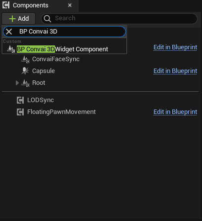
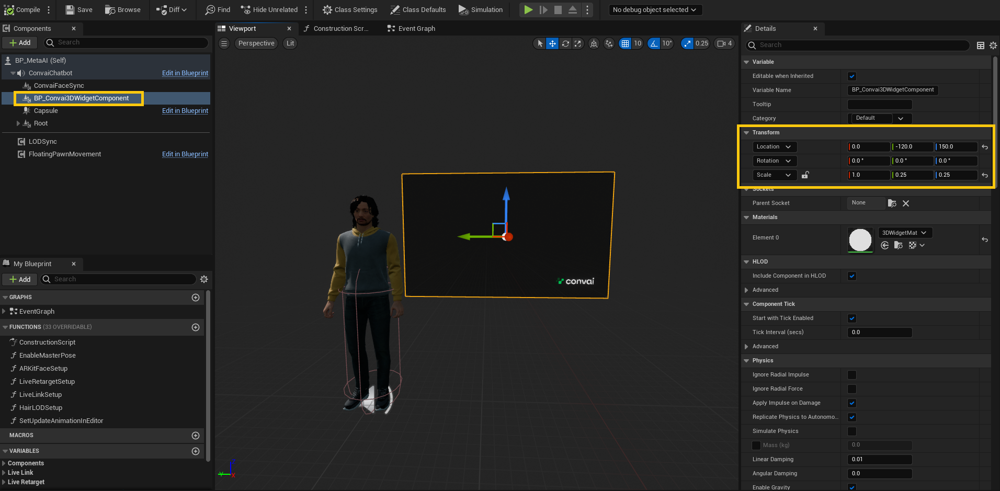

# 3D Chat Widget

#### Steps to Set Up the 3D chat widget

1. Go to the following [Google Drive link](https://drive.google.com/drive/folders/109XAhnnozXsuIyx_68lkz0mhcFGXMSeE?usp=drive_link) and download the **Convai Convenience Pack**.
2. Unzip the file and place it in `ProjectDirectory/Content` folder.

#### Adding the BP Convai 3DWidget Component

1. Navigate to your player blueprint.&#x20;
2. Go to the **Viewport** tab.

<figure><figcaption></figcaption></figure>

3. Under the **Components** tab, click the **Add** button, search for **BP Convai 3DWidget Component**, and add it.

<figure><figcaption></figcaption></figure>

4. Select the newly added component and adjust the transform according to your needs.

<figure><figcaption></figcaption></figure>
