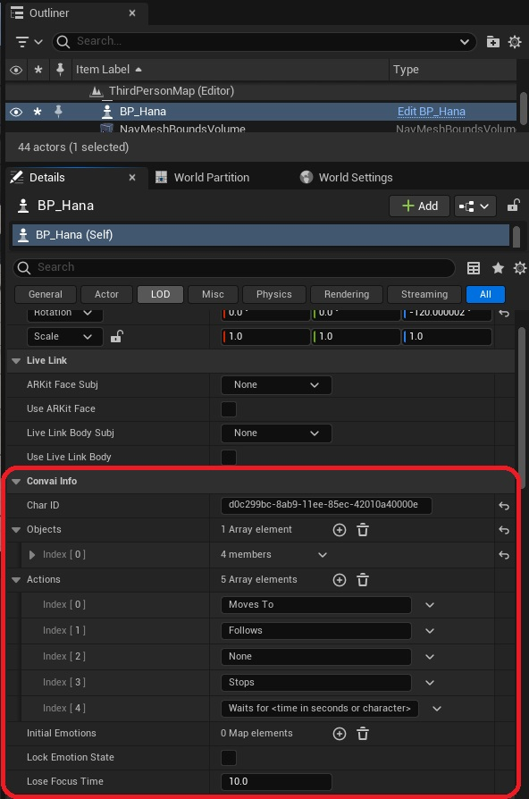

# Simple actions

Steps to add simple actions to your Convai character:-&#x20;

* Select your Convai Character and navigate to the Details panel. Within this interface, locate the  `Convai Info` section.&#x20;

<figure><figcaption>
Convai Info section in Outliner. 
</figcaption></figure>

* Select the `Add Element` icon `(+)` and input the desired action you wish to execute. For example, `Print.`

<figure><figcaption>
Custom Action
</figcaption></figure>

* Open the character blueprint to which you have just now added the action.&#x20;
*   Add a new event with the same name. `Print` in this case and define the logic for the function you just named and run the function `Handle Actions Completion` with `Is Successful` set to true. \

    <figure><figcaption>
Print action implementation
</figcaption></figure>
* Hit compile and ask your Convai Character to perform the action.&#x20;

<figure><figcaption>
The Convai Character Prints when asked to perform. 
</figcaption></figure>
