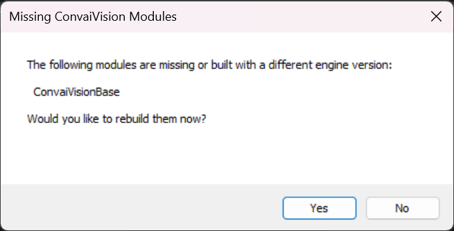

# Convai Vision Integration

***

## Introduction

Convai Vision enhances your Unreal Engine characters with advanced visual capabilities. This feature allows characters to perceive the game environment or connect to a webcam for real-world awareness, enabling immersive and interactive experiences. Follow this guide to set up and utilize the Vision Plugin in your project.

***

## Prerequisites

Before starting, ensure you meet these requirements:

1. **Basic Unreal Engine Knowledge**: Familiarity with the Unreal Engine interface and workflows.
2. **Unreal Engine C++ Project Setup**: A functional C++ Unreal Engine project environment.
3. **Convai Plugin**: The Convai Plugin must be installed and activated in your project. Refer to the [Convai Plugin Setup Guide](../guides-v2-under-development/getting-started/download-and-setup.md).

***

## Step-by-Step Guide

### **1. Download the Convai Vision Plugin**

* Download the Convai Vision Plugin below.


Convai Unreal Engine Vision Folder


* Extract the `.zip` file.
* Ensure the extracted folder is `Convai-UnrealEngine-Vision-Base`.

### **2. Set Up the Unreal Engine Project**

1. Open Unreal Engine 5.x and create a **Blank C++ Project**.

<figure><figcaption></figcaption></figure>

2. Enable the Convai Plugin in the project settings.
3. In the **Content Browser**, click **Add** > **Add Feature or Content Pack**. Add the **First Person** or **Third Person Template**.

<figure><figcaption></figcaption></figure>

4. Prepare your **Player Blueprint** and **Convai Character Blueprint**, ensuring they can interact in your level.
5. Close the project once the setup is complete.


Check the [Convai Plugin Setup Guide](../guides-v2-under-development/getting-started/download-and-setup.md) if needed.


### **3. Add the Convai Vision Plugin**

1. Navigate to your project folder (e.g., `C:\Unreal Projects\ConvaiVision`).
2. Create a new folder named **Plugins** (case-sensitive).&#x20;

<figure><figcaption></figcaption></figure>

3. Copy the extracted `Convai-UnrealEngine-Vision-Base` folder into the `Plugins` directory.

<figure><figcaption></figcaption></figure>

4. Open the project using the `ConvaiVision.uproject` file.
5. When prompted to rebuild the project, click **Yes**.

<figure><figcaption></figcaption></figure>

**4. Integrate Vision into Your Convai Character**

1. Open the **Blueprint** for your Convai Character.
2. In the **Components** panel, click **Add** and select **EnvironmentWebcam**.

<figure><figcaption></figcaption></figure>

3. Select the **EnvironmentWebcam Component** and move it in the **Viewport** so it is positioned in front of your character’s eyes. This component acts as the "eyes" of your character.

<figure><figcaption></figcaption></figure>

### 4. **Configure the Render Target**

1.  With the **EnvironmentWebcam Component** selected, go to the **Details** panel:

    * Under the **Convai** section, locate the **Vision** property.

    <figure><figcaption></figcaption></figure>

    *   Assign a **Render Target** to the **Convai Render Target** variable:

        * Click the dropdown next to **None**.
        * Select **Create New Asset** > **Render Target**.

        <figure><figcaption></figcaption></figure>

        * Save the new Render Target with a name like `RT_ConvaiVision`.

        <figure><figcaption></figcaption></figure>
2.  Open the Render Target:

    * In the **Details** panel, set **Size X** and **Size Y** to `512x512`.
    * Set the **Render Target Format** to **RTF RGBA8**.

    <figure><figcaption></figcaption></figure>

### **5. Finalize the Setup in the Event Graph**

1. Open the **Event Graph** of your Convai Character Blueprint.
2. Drag the **EnvironmentWebcam Component** into the Event Graph.
3. From this component, call the **Start** function and connect it to the **Begin Play** node.

<figure><figcaption></figcaption></figure>

***


For optimal results, we recommend setting the **Foundation Model** to **Claude** in the **Core AI Settings** of your character on [Convai.com](https://convai.com)


***

## Conclusion

Congratulations! :tada::sunglasses:&#x20;

You’ve successfully integrated the Convai Vision Plugin into your Unreal Engine project. Your character can now perceive the game world and provide information about it. Additionally, by connecting a webcam, the character can process real-world visual data.

For questions or further assistance, visit the [Convai Developer Forum](https://forum.convai.com/).
