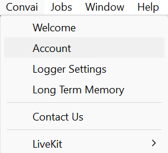

# Event-Aware Convai Characters

## Use of Invoke Speech function&#x20;

Let's assume the player steps into a region and wants the Convai Character to greet him. Let's have an event to detect player overlap within the region. So whenever the event gets fired the Covnai character knows that the player has arrived

<figure><figcaption></figcaption></figure>
