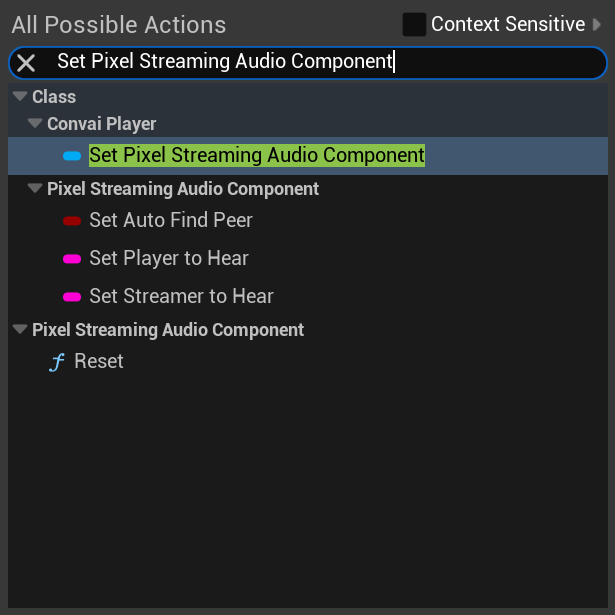

# Integration with Pixel Streaming


To setup the Pixel Streaming server, we recommend taking a look over [this excellent guide](https://github.com/TensorWorks/PixelStreamingCloudGuide/blob/main/Pixel%20Streaming%20UE5.md).


1. Ensure you have the latest Convai 3.1.0 plugin or later.
2.  Enable Unreal Engine's `Pixel Streaming` and the `Pixel Streaming Player` Plugins from the Plugins window. 

    <figure><figcaption></figcaption></figure>
3.  In the player blueprint which has the Convai Player component, add the PixelStreamingAudio component to the list of components. 

    <figure><figcaption></figcaption></figure>
4.  Click on PixelStreamingAudio component, and in the details panel find Base Submix and choose AudioInput sound submix. 

    <figure><figcaption></figcaption></figure>
5. On Begin Play in the event graph, add the following blueprint function to initialize Pixel Streaming with the Player Component.

<figure><figcaption></figcaption></figure>

<figure><figcaption>
To Get <em><strong>Set Pixel Streaming Audio Component</strong></em> Node
</figcaption></figure>


Now, pixel streaming mic input should be working. However, system microphone will no longer work. To change back and forth to and from system microphone, set Use Pixel Streaming Mic Input to true for enabling pixel streaming microphone and false to enable system microphone. This is found in the ConvaiPlayer component.


<figure><figcaption></figcaption></figure>
