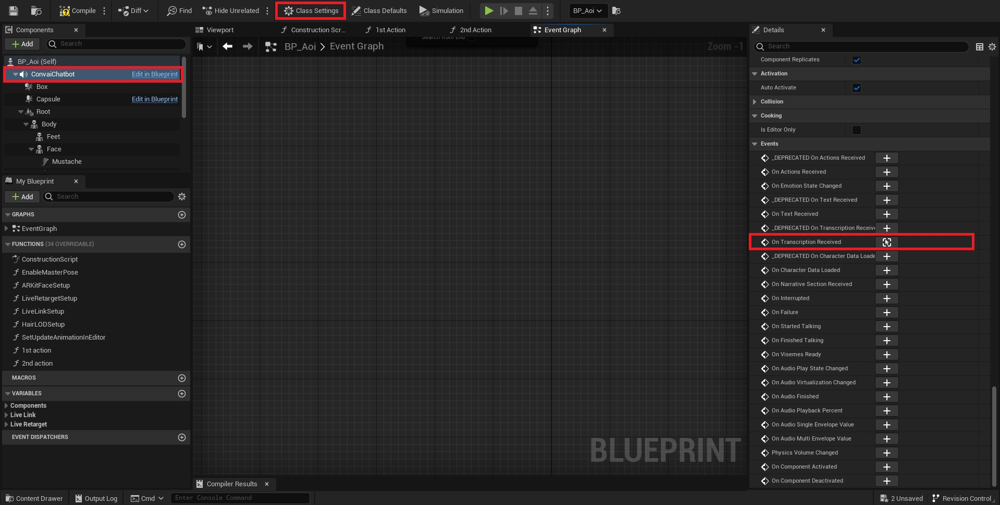

# Operations Based on the Presence of Certain Words

* Open your Convai Character blueprint and click on `Class Settings` and then on `ConvaiChatbot` component.&#x20;
* Under the `Details` section scroll down to the `Events` section and add `On Transcription Received` event.&#x20;

<figure><figcaption>
Add On Transcription Received Event to Event graph. 
</figcaption></figure>

* Once we have the transcription of player input, we can perform a substring search on it.

<figure><figcaption>
Substring search on transciption. 
</figcaption></figure>


The Print String at the end is just an example. You can add your logic after the substring match.&#x20;


&#x20;
