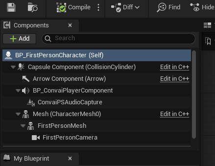
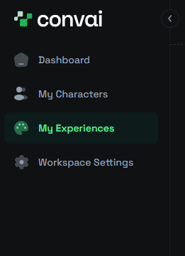
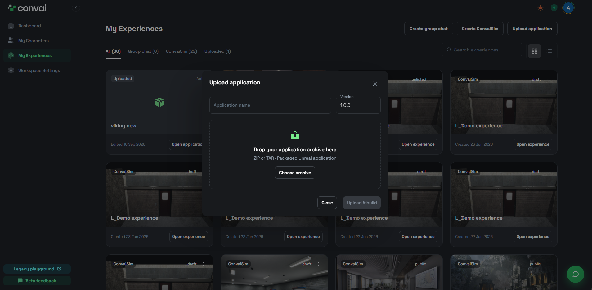

# Packaging your Unreal project for deployment

Convai hosts your packaged Unreal experience and streams it to a browser. You enable Pixel Streaming, package a Windows build, compress it, and upload that archive to Convai. This page is for developers whose project already runs in the Unreal Editor.


Enable Pixel Streaming before you package. Unreal compiles plugins into the build, so enabling the plugin afterwards has no effect on a build that already exists.


## Before you start

* [ ] An Unreal Engine project that opens and runs in the Editor
* [ ] A Windows machine with Visual Studio 2022 and the **Game development with C++** workload
* [ ] Free disk space of roughly three times your project size

## Prepare and package the project



### Enable Pixel Streaming

In the Unreal Editor, open **Edit > Plugins** and search for Pixel Streaming. Enable one version:

* **Pixel Streaming 2** on Unreal Engine 5.5 and later
* **Pixel Streaming** on earlier versions, or where **Pixel Streaming 2** is not listed

Restart the Editor when it prompts you.



### Add the audio capture component

This step applies to projects that use the Convai Unreal Engine plugin. If you have not installed it, follow [Convai Unreal Engine plugin](https://docs.convai.com/api-docs/plugins-and-integrations/convai-unreal-engine-plugin) first.

Open the blueprint that holds `BP_ConvaiPlayerComponent`, select **Add** in the **Components** panel, and add `ConvaiPSAudioCapture` under that component. It routes microphone audio from the browser into your character, so the character hears a viewer who is talking through the stream.

<figure><figcaption><p><code>ConvaiPSAudioCapture</code> added under <code>BP_ConvaiPlayerComponent</code></p></figcaption></figure>

Compile and save the blueprint.



### Package the project for Windows

Open **Platforms > Windows > Build Configuration** and select **Shipping**, then open **Platforms > Windows > Package Project** and choose an empty output folder.

The first package can take 30 to 45 minutes, because Unreal cooks every asset in the project. Later packages reuse that work and finish faster.

When packaging finishes, the output folder holds `YourProject.exe` alongside the `Engine` and `YourProject` folders.



### Compress the build

Compress the packaged folder into a single `.zip` or `.tar` archive. Convai accepts either format.



## Upload the build to Convai



### Open your experiences

Sign in at [convai.com](https://convai.com) and select **My Experiences**.

<figure><figcaption><p>Selecting <strong>My Experiences</strong></p></figcaption></figure>



### Upload the archive

Select **Upload application**, enter an **Application name** and a **Version**, then select **Choose archive** and pick the archive you compressed.

<figure><figcaption><p>The <strong>Upload application</strong> dialog</p></figcaption></figure>

Select **Upload &#x26; build**.



### Wait for the deployment

Convai builds and deploys the uploaded application. This takes a few minutes.



### Test the stream

When the deployment finishes, select the test button on your application. It opens your experience on its `convai.com` address, where your packaged project streams in the browser.



## Confirm Pixel Streaming is in the build

A package that succeeds does not prove the plugin reached the build. Unreal links plugin modules directly into the executable for a Shipping build, so the packaged `Plugins` folder shows nothing either way.

Read the build receipt before you upload:

```powershell
$receipt = "Windows\YourProject\Binaries\Win64\YourProject-Win64-Shipping.target"
(Get-Content $receipt -Raw | ConvertFrom-Json).BuildPlugins
```

The returned list names `PixelStreaming` or `PixelStreaming2` when the plugin compiled into the build. If neither appears, the build cannot stream.

## Troubleshooting

### The build renders but nothing streams

**Symptom:** the deployed application loads and no stream reaches the browser.

**Cause:** Pixel Streaming was not enabled when the project was packaged.

**Fix:** enable the plugin in the Editor, package the project again, and upload the new archive.

**Verification:** run the build receipt check described earlier on this page and confirm the plugin is listed.

### The character does not hear the viewer

**Symptom:** the stream plays and the character does not respond to speech from the browser.

**Cause:** `ConvaiPSAudioCapture` is missing from the blueprint that holds `BP_ConvaiPlayerComponent`.

**Fix:** add the component, compile the blueprint, then package and upload again.

**Verification:** the component appears under `BP_ConvaiPlayerComponent` in the **Components** panel.

### Packaging stops with a path length error

**Symptom:** packaging fails with `The following action paths are longer than 260 characters. Please move the engine to a directory with a shorter path.`

**Cause:** Unreal enforces a 260-character limit on build paths. Pixel Streaming stages a deeply nested web server folder, which pushes paths past that limit when the project sits far from the drive root.

**Fix:** move the project closer to the drive root, such as `C:\Projects\MyGame`, and package again.

**Verification:** packaging passes the build stage and starts cooking content.

## Next steps

* [Convai Pixel Streaming Embed](../../convai-pixel-streaming-embed) embeds the deployed experience in a React or JavaScript application.
* [Integration with Pixel Streaming](integration-with-pixel-streaming) covers the in-editor Pixel Streaming setup, including audio submix configuration.
