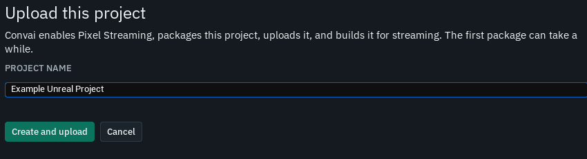
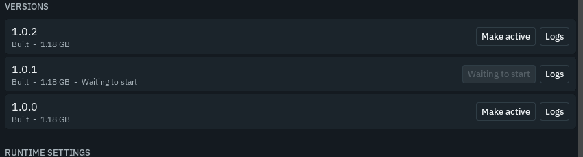
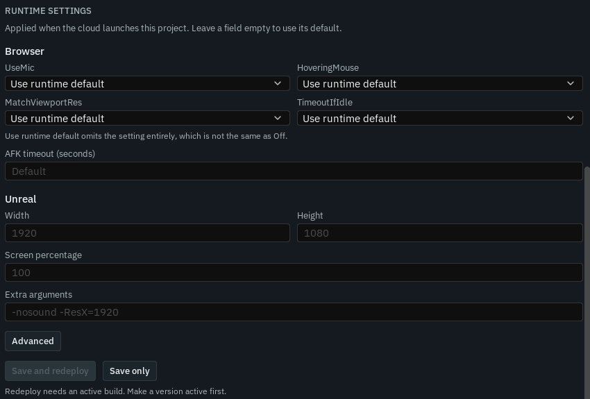

Use **Cloud Projects** in the Convai Unreal Engine plugin to package the open Unreal project, upload it to Convai, and stream it in a browser. The same Editor panel lets you inspect versions, change runtime settings, and publish an experience page.

## Before you begin

Open a project with the Convai Unreal Engine plugin enabled. Sign in to your Convai account from the Editor if **Cloud Projects** prompts you. The Editor needs the Windows platform SDK because Cloud Projects packages a `Win64` `Development` build. Leave enough disk space for both the staged build and its compressed archive.

Cloud Projects needs Unreal's Pixel Streaming plugin installed. During preparation, it enables Pixel Streaming for this project if needed. A newly enabled plugin is included in the packaged build, but you must restart the Editor before testing Pixel Streaming in the Editor.

### Use a different Convai environment

Cloud Projects follows the API host configured for the Convai plugin, including the `CustomBetaURL` project setting or a `-ConvaiBetaURL=` launch override. Use `-ConvaiProjectApiURL=` when only Cloud Projects should use a different API host. If that environment uses a separate browser player host, `-ConvaiExperienceURL=` overrides the player URL. Sign in with credentials for the environment you selected.

## Create and upload a cloud project



### Open Cloud Projects

In Unreal Editor, select **Tools > Convai > Cloud Projects**. Select **Sign in** if the panel asks for your Convai account.



### Name the project

Select **+ New project**. The **PROJECT NAME** field starts with the open Unreal project's name; change it if needed. This name appears in your Convai project list.

<figure><figcaption>
Name the open Unreal project before starting its upload.
</figcaption></figure>



### Start the upload

Select **Create and upload**. The panel shows the stage, progress, and elapsed time. The first package can take 30–45 minutes while Unreal cooks the project's assets. Unreal's packaging notification provides the packaging log.



Cloud Projects runs these stages in order:

| Stage | What the plugin does |
| --- | --- |
| **Prepare** | Enables Pixel Streaming if needed and tries to add `ConvaiPSAudioCapture` to project-owned Blueprints with a Convai player component. |
| **Package** | Packages the open project as a `Win64` `Development` build. |
| **Compress** | Creates an archive from the packaged build. |
| **Upload** | Reserves a version and sends the archive to Convai. |
| **Cloud build** | Builds the uploaded version for streaming. |
| **Activate** | Requests that the new build serve the project. |

Preparation may change the project's `.uproject` file and save Blueprints under `/Game/`. It does not modify the plugin's sample content. If the audio component is unavailable in this Editor session, restart the Editor and use **Upload changes** to let preparation add it.

**Cancel** stops the local packaging or upload work. A build already started on Convai continues if you close the tab.

## Check the project and open the stream

Select the project in **Cloud Projects** and use **Refresh** while the build or rollout is in progress. A project marked **Live** has a build available to stream. The version shown in the project list is the newest uploaded version; check the **VERSIONS** rows to see which version is **Active**.

Select **Open in browser** when it becomes available. The plugin creates an experience page if this project has none, starts a stream session, and opens the Convai player. Check that the Unreal project appears in the browser. If it uses a Convai character, also test microphone input from the browser.

## Upload changes and manage versions

To update an existing project, select it and choose **Upload changes**. Cloud Projects packages the Unreal project currently open in the Editor and adds a version with the next version number. If the open Unreal project's name differs from the selected cloud project's name, the panel warns you which project the upload will replace.

The **VERSIONS** list shows each version's build state, archive size, and rollout state. **Uploaded** means the archive is stored; **Building** means Convai is processing it; **Built** means it is ready to activate. **Build failed** identifies a version that needs log review. **Active** identifies the version serving viewers. **Preparing** and **Waiting to start** mean a requested rollout is still in progress.

<figure><figcaption>
Inspect each version's build and rollout state before activating it.
</figcaption></figure>

Select **Make active** on a built version to serve it. Selecting a different built version during a rollout replaces the pending request. If a rollout is moving away from the version that is serving, **Cancel rollout and keep active** lets you keep that version. Select **Logs** on a version to inspect its build report, especially when its state is **Build failed**.

## Change runtime settings

Select a project and scroll to **RUNTIME SETTINGS**. These settings control how its streamed process starts; changing them does not require a new package or archive upload.

<figure><figcaption>
Browser and Unreal runtime settings for a selected project.
</figcaption></figure>

Under **Browser**, each choice offers **Use runtime default**, **On**, and **Off**. **Use runtime default** omits the override; it does not force **Off**.

| Browser setting | Effect |
| --- | --- |
| `UseMic` | Enables browser microphone capture. |
| `HoveringMouse` | Sends pointer movement without locking the pointer. |
| `MatchViewportRes` | Matches the browser viewport and hides explicit resolution fields when **On**. |
| `TimeoutIfIdle` | Disconnects an idle session. |

**AFK timeout (seconds)** sets the idle window. Leaving it empty removes that override.

Under **Unreal**, enter **Width** and **Height** together for an explicit resolution. If `MatchViewportRes` is **On**, those fields are hidden. **Screen percentage** sets the internal render scale, and **Extra arguments** are passed to the Unreal process.

**Advanced** exposes the browser settings as a JSON object and a **Disable VPX compute shader** control. The JSON accepts boolean, number, or text values. The VPX control writes `-PixelStreamingVPXUseCompute=false` to **Extra arguments**.

Select **Save and redeploy** to save changes and restart a version marked **Active**, without packaging or uploading again. Select **Save only** to apply the settings at the next deployment. An unchanged save may queue no redeploy. Hosting capacity and sleep settings are managed in the Convai dashboard's **Hosting** tab.

## Publish the experience page

The first **Open in browser** action creates an experience page for the project if needed. In **PUBLISH**, enter a **Page name** and **Short description**, then choose **Public**, **Unlisted**, or **Private**. **Live now:** shows the audience already in effect, which may differ from your unsaved choice.

Select **Publish** to make the page live at the selected audience. Select **Save draft** to store its details without making it live.

## Troubleshooting

| What you see | What to do |
| --- | --- |
| `Sign in to Convai to manage your uploaded projects.` | Use **Sign in** in the panel, then select **Refresh**. |
| `This editor cannot package for Win64.` | Install the Windows platform SDK for this engine, restart the Editor, and try again. |
| Packaging fails | Open Unreal's packaging log from its notification, fix the reported problem, and select **Upload changes**. |
| An archive entry is too large | Split the packaged content into smaller files or pak chunks. The archiver rejects a single entry above 1.5 GB before upload. |
| A version says **Build failed** | Select **Logs** on that version to read the build report. |
| The build succeeds but activation fails | Use **Make active** on the built version to retry activation; the archive is already uploaded. |
| **Save and redeploy** is unavailable | Wait for a version row to show **Active**, or use **Make active** on a built version. |
| The browser stream works but the Convai character cannot hear speech | Check the preparation notes for an audio-component warning. Restart the Editor and use **Upload changes** so the plugin can add `ConvaiPSAudioCapture` to a project Blueprint with a Convai player component. |
