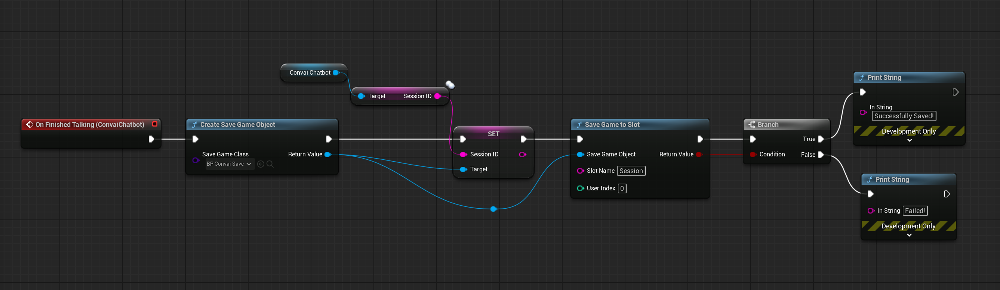
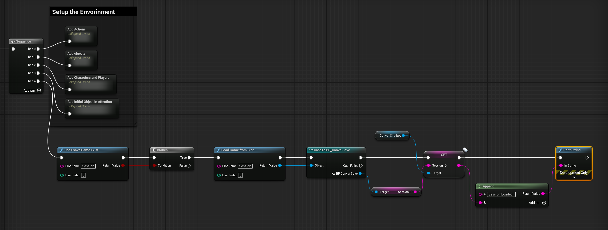

# Saving and Loading Session

### Introduction

This guide explains how to save and load the Session ID using Unreal Engine's SaveGame system. The steps are implemented in the **ConvaiBaseCharacter Blueprint.** By following this guide, you'll be able to store and retrieve Session IDs seamlessly in your project.

### Prerequisites

Before starting, ensure you have the following:

* Basic knowledge of Unreal Engine Blueprints.
* Familiarity with the SaveGame system in Unreal Engine.

### Step 1: Create the SaveGame Blueprint

To save the Session ID, you need to create a SaveGame Blueprint that will store the data.

1. **Open the Content Browser:**\
   Go to the Content Browser in Unreal Engine.
2. **Create a SaveGame Blueprint Class:**
   * Right-click in the Content Browser.
   * Select: **Blueprint Class > Search for `SaveGame` > Choose SaveGame**.
   * Name the new Blueprint `BP_ConvaiSave` (you can name it whatever you like, but ensure consistency in your Blueprint references).
3. **Add a Variable to Store Session ID:**
   * Open the `BP_ConvaiSave` Blueprint.
   * In the Variables panel, click **+** to create a new variable.
   * Configure the variable as follows:
     * **Name:** `SessionID`
     * **Type:** `String`
   * Compile and save the Blueprint.

Your SaveGame object is now ready to store the Session ID.

### Step 2: Saving the Session ID

In the **On Finished Talking** event of the **ConvaiBaseCharacter Blueprint**, implement the following steps to save the Session ID:

1. **Create Save Game Object:**
   * Add the `Create Save Game Object` node.
   * Select `BP_ConvaiSave` as the class.
2. **Set Session ID:**
   * Use the `Set SessionID` node to assign the Session ID from the Convai Chatbot to the SaveGame object.
3. **Save Game to Slot:**
   * Use the `Save Game to Slot` node to save the SaveGame object to a slot named `"Session"` (you can choose any slot name, but remember to use the same name when loading the saved data).
   * Use a `Branch` node to check if the operation was successful.

<figure><figcaption>
This Blueprint shows how the Session ID is saved to a SaveGame slot when the chatbot finishes talking.
</figcaption></figure>

### Step 3: Loading the Session ID

In the **Begin Play** event of the **ConvaiBaseCharacter Blueprint**, implement the following steps to load the Session ID:

1. **Check if Save Exists:**
   * Use the `Does Save Game Exist` node to check if a save file exists in the `"Session"` slot.
2. **Load Save Game from Slot:**
   * If a save exists, use the `Load Game from Slot` node to load the SaveGame object.
3. **Cast to BP\_ConvaiSave:**
   * Use the `Cast to BP_ConvaiSave` node to access the `SessionID` variable in the SaveGame object.
4.  **Set Session ID:**

    * Assign the loaded `SessionID` back to the Convai Chatbot.

    <figure><figcaption>
This Blueprint demonstrates how to load the Session ID from the SaveGame system and set it back to the Convai Chatbot.
</figcaption></figure>

### Key Blueprint Nodes Used

* **Create Save Game Object:** Creates the SaveGame instance for storing data.
* **Set SessionID:** Assigns the Session ID to the SaveGame object.
* **Save Game to Slot:** Saves the created instance to disk.
* **Does Save Game Exist:** Checks if a save file exists in the specified slot.
* **Load Game from Slot:** Loads the saved data from disk.
* **Cast to BP\_ConvaiSave:** Accesses the stored data in the SaveGame object.

### Conclusion

By following this guide, you now have a functional system for saving and loading Session IDs in your project using Unreal Engine’s SaveGame system. This implementation focuses on storing data locally, but you can expand it to include server-side storage or custom file handling if needed.

For further customization or advanced functionality, explore Unreal Engine’s documentation or community tutorials.&#x20;

If you have any questions, feel free to ask on the [Convai Developer Forum](https://forum.convai.com/)! 🎉😎
