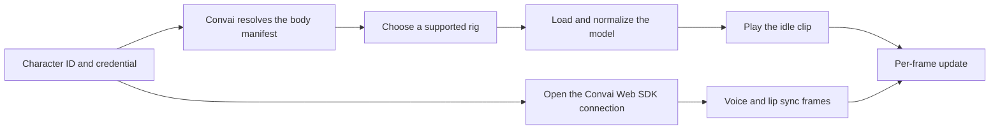

This page explains how Convai Embody gets from a character ID to a body that speaks, and the design choices behind it. For the steps to add a character to a page, see [Add a 3D character to a React app](add-a-3d-character-to-a-react-app.md).

## One credential, one connection

A talking character has two halves: a body to render and a mind that listens and replies. The Convai Web SDK already provides the mind, a `ConvaiClient` that streams the conversation and the character's voice. Convai Embody adds the body and connects the two.

The reason Convai Embody opens the connection itself, instead of asking the app for a client, is that lip sync must come from the same session that produces the voice. Two clients means two sessions: one is heard and the other drives the mouth, so the character either moves its lips to nothing or stays still while it talks. Opening one connection and handing it back as `character.client` removes that failure. It is also why the chat widget is fed through `useWidgetClient` rather than `useConvaiClient`, which would construct a second client.

The connection asks Convai for MetaHuman blendshape frames by default. Without that request Convai sends no lip sync data, and the character would talk with a still face.

## From character ID to body

Convai resolves a character ID to a body manifest: the model to load, its animation clips, and the rig it was built for. A character's avatar can have its own published web body. When it has none, Convai serves the default body configured for the avatar's gender, or the neutral default for a character with no avatar. When neither exists, the request fails with `Character has no 3D embodiment configured.`

The manifest can offer the same body for several rigs. Convai Embody picks the first rig it understands. The supported rig is `convai-mha-1`, the Unreal Engine MetaHuman rig, and its bone and morph target names are data on a rig profile rather than code, so supporting another rig means adding a profile.

Models are Draco-compressed, so the loader needs the Draco decoder. The model is then scaled to a standing human height and placed with its feet on the floor, and the idle clip starts, so a character is never left in its bind pose.

## The frame pipeline

Every frame, the systems that move the character run in a fixed order. The order is part of the design: each system writes to bones or morph targets that a later system reads or overrides.

| Order | System | Why it runs here |
|---|---|---|
| 1 | Unit normalization | The model's scale must settle before anything reads positions in the scene. |
| 2 | Animation clips | The clips pose the skeleton. |
| 3 | Gaze | Gaze replaces the clip's head rotation instead of blending with it, so it runs after the clips. |
| 4 | Breathing | Breathing is added on top of the pose the clips wrote, so it runs after them and never accumulates. |
| 5 | Lip sync, then eye movement, then blinking | Blinking runs after lip sync so it controls the eyelid channels that both touch. |

Gaze tracks the camera with the head and neck, drifts slightly at rest, and occasionally looks away. Breathing moves the chest before the waist. Blinks vary in timing and completeness, and the eyelids follow downward gaze.

## Reduced motion

When the user's system requests reduced motion through the `prefers-reduced-motion` media query, Convai Embody damps the additive motion layers, such as breathing and idle drift, and suppresses look-away shifts. Lip sync and animation clips are not damped, because they carry meaning: a muted mouth would make the character harder to understand without making it calmer to look at.

## Environments

Each release of `@convai/embody` talks to one Convai environment, set by its default `baseUrl`. Character IDs belong to one environment and do not carry over to another. An ID from a different environment fails with a not-found error that reads like a permissions problem but is a wrong-environment problem.

## Related concepts


[Lipsync & Blendshape](../convai-web-sdk/lipsync-and-blendshape/README.md)

