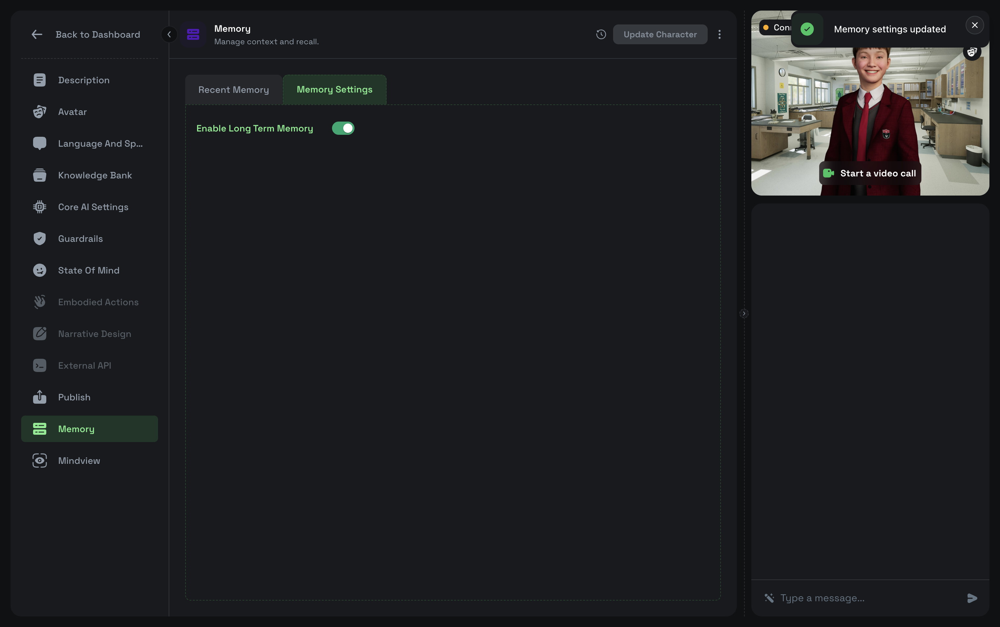

# Long Term Memory

### Enable memory

This is a character based feature. Go to you convai dashboard -> Character -> Memory tab -> Memory Settings -> Enable Long Term Memory

<figure><figcaption></figcaption></figure>

Pass `endUserId` when connecting:

```ts
const client = useConvaiClient({
  apiKey: 'YOUR_API_KEY',
  characterId: 'YOUR_CHARACTER_ID',
  endUserId: 'a1b2c3d4-...',  // any string — (UUID or email) preferred, e.g. 'user@example.com'
});
```

`client.memoryManager` becomes available after a successful connection.

### Access the manager

```ts
const memory = client.memoryManager;

if (!memory) {
  // endUserId was not provided, or client is not yet connected
  return;
}
```

***

### List memories

```ts
const result = await memory.listMemories({ page: 1, pageSize: 50 });

console.log(`Total: ${result.total_count}`);
console.log(`Has more: ${result.has_more}`);

result.memories.forEach(m => {
  console.log(`[${m.id}] ${m.memory}`);
  // m.created_at, m.updated_at (ISO timestamps)
});

// Paginate if needed
if (result.has_more) {
  const page2 = await memory.listMemories({ page: 2, pageSize: 50 });
}
```

#### Parameters

| Field      | Type     | Default | Range  |
| ---------- | -------- | ------- | ------ |
| `page`     | `number` | `1`     | 1–1000 |
| `pageSize` | `number` | `50`    | 1–100  |

***

### Add memories

Pass one or more strings to add as memories:

```ts
const result = await memory.addMemories([
  'User prefers dark mode UI.',
  'User is learning Spanish.',
  'User plays guitar as a hobby.',
]);

result.memories.forEach(m => {
  console.log(`Added: ${m.id} → ${m.memory}`);
});
```

The character will use these in future conversations automatically.

***

### Get a single memory

```ts
const m = await memory.getMemory('f4cbdb08-7062-4f3e-8eb2-9f5c80dfe64c');

console.log(m.memory);      // "User prefers dark mode UI."
console.log(m.created_at);  // ISO timestamp
console.log(m.updated_at);  // ISO timestamp
```

***

### Delete a memory

```ts
const result = await memory.deleteMemory('f4cbdb08-7062-4f3e-8eb2-9f5c80dfe64c');

if (result.deleted) {
  console.log('Deleted:', result.memory_id);
}
```

***

### Delete all memories

Removes all memories for the (character, user) pair. Deletion is asynchronous on the server.

```ts
const result = await memory.deleteAllMemories();
console.log(result.message); // "Memory deletion in progress..."

// Wait briefly and verify
await new Promise(r => setTimeout(r, 2000));
const check = await memory.listMemories();
console.log('Remaining:', check.total_count);
```

***

### Standalone usage

`MemoryManager` can be used independently of the client (e.g., in a backend admin tool):

```ts
import { MemoryManager } from '@convai/web-sdk/core';

const manager = new MemoryManager(
  'YOUR_API_KEY',      // or auth token
  'CHARACTER_ID',
  'END_USER_ID',
);

const memories = await manager.listMemories();
```

***

### Memory object shape

```ts
interface Memory {
  id: string;          // UUID
  memory: string;      // Text content
  created_at: string;  // ISO 8601 timestamp
  updated_at: string;  // ISO 8601 timestamp
}
```

***

### How automatic memory works

When `endUserId` is set, the Convai backend extracts meaningful facts from each conversation and stores them as memories. On future connections with the **same** `endUserId`, these memories are injected into the character's context so it "remembers" the user. This is why the value must be stable and unique per user — a UUID or email address both work well.

You do not need to call any Memory API methods for this to work. The explicit CRUD methods are for reading, seeding, or pruning memories from your application.
